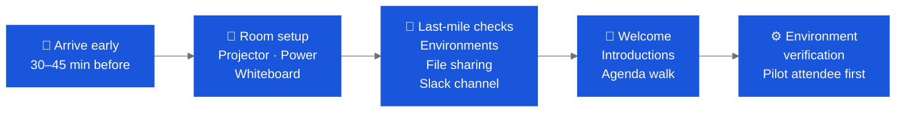

# Day-of Guide

The Bobathon is live. This page covers what to do from the moment you walk in the door to the moment attendees leave.

---

## Opening Sequence (First 30 Minutes)

The first 30 minutes set the tone for the entire day. Move through these quickly but don't rush setup.



### Arrive 30–45 Minutes Early
- Set up projector and test display
- Place printed lab guides (if using)
- Confirm Wi-Fi credentials are posted or available
- Set up CE team Slack channel and pin key links (lab guide, file share, survey link)
- Do a quick smoke-test: open Bob on your machine, confirm it connects

### Last-Mile Environment Checks
- Verify that at least 2–3 client machines are confirmed working (don't wait for all)
- Confirm file sharing method works from client machines
- Check that TechZone / LPAR connections are live (for Z / IBM i tracks)
- Have USB drives and offline installers ready for install failures

---

## Roles on the Day

| Role | Responsibility |
|---|---|
| **CE Lead** | Presents, facilitates, drives narrative; manages time |
| **CE Support(s)** | Circulate and assist attendees 1:1; handle install issues; monitor pace |
| **FDE** | Post-sale context — co-facilitates or leads where the Bobathon is an activation or scaled pilot motion |
| **CVE** | Post-sale context — owns the focus product narrative; positions Bob as the build accelerator; ties the session to the Adoption Plan |
| **Client Lead** | Ensures attendees are engaged; manages client-side logistics; escalation point |
| **COBOL / Z / i SME** | Answers domain-specific questions Bob can't answer (for Z and IBM i events) |

**Never have the CE Lead doing both facilitation and hands-on support simultaneously.** If only one CE is present, facilitate from the front and invite attendees who finish early to help their neighbors.

!!! info "CVE-led sessions"
    When a CVE owns the Bobathon, the headline should be **the focus SaaS product**, not Bob. Bob is the accelerator. The CVE manages the product narrative and Adoption Plan linkage; a CE or FDE can support facilitation. See [Bobathons in the CVE Motion](../followup/cve.md).

---

## Pacing the Day

### The Golden Rule
> **Clients take 2–5x longer than IBM practitioners to complete labs.** Always add buffer. Never cut the debrief.

### Managing Fast vs. Slow Attendees

- **Fast finishers:** Have stretch exercises ready — ask them to try the same lab prompt on a different program, or explore a different mode
- **Struggling attendees:** CE support 1:1 in the collaboration area; don't slow the room down for one person
- **Very slow group:** Use the "baking show" — show the completed endpoint and explain what Bob produced; then let them catch up in parallel

### Time Management Signals
- **On track:** Group completes lab within expected time ± 10%
- **Running long:** Invoke the baking show for remaining steps; keep narrative moving
- **Running short:** Extend open experimentation time or add a stretch exercise from the adventure labs

---

## During Labs: CE Facilitation Tips

!!! quote "Lessons Learned"
    *"The client will not do pre-work — including installing prerequisites, even when sent ahead of time. Have a plan B."*

    *"Have a Slack channel for the IBM team."*

- **Don't just watch — circulate.** CE support should be walking the room constantly, looking at screens, offering guidance proactively.
- **Narrate what Bob is doing.** During labs, explain *why* you're giving Bob a particular prompt, not just what it produces. Build mental models.
- **Celebrate quick wins.** When Bob produces something impressive, pause and let the room react. This is what drives pilot conversations.
- **Capture quotes.** When an attendee says something positive, note it. These become the pilot proposal's proof points.
- **Encourage experimentation.** Remind attendees that the Bobathon is a safe space — they can try anything, break things, explore.

---

## Handling Common Issues

See [Troubleshooting](troubleshooting.md) for the full issue guide. Key day-of responses:

| Issue | Immediate Response |
|---|---|
| **Attendee can't install Bob** | Move them to share a CE laptop or pair with a working attendee |
| **TechZone / LPAR unreachable** | Switch to the pre-configured VM or use CE laptop fallback |
| **Bob produces poor output** | Rephrase the prompt; explain how prompt quality affects output; show the correct approach |
| **Lab runs out of time** | Invoke baking show (show endpoint snapshot); continue narrative; don't abandon the use case |
| **Java 21 not installed (Z/i)** | Have offline installer on USB; install during the break |
| **Client code can't be accessed** | Switch to sample app; position it as "let's use this to learn the pattern, then you apply it to your code" |

---

## The Debrief (Last 20–30 Minutes)

The debrief is where the Bobathon earns its ROI. **Don't skip it or cut it short.**

### Debrief Structure

1. **Quick personal reflection (5 min)**
   > *"In one sentence — what surprised you most about what Bob could do today?"*

2. **Use case review (10 min)**
   > *"For [use case 1] — what would this change for your team? How long does this currently take manually?"*

3. **Blockers and concerns (5 min)**
   > *"What would prevent you from using Bob regularly after today?"*

4. **Pilot framing (5 min)**
   > *"Based on what you've seen today — what would a 2–3 week pilot look like? What would you want to prove? Or do you have enough to move straight to a proposal?"*

5. **Action items and next steps (5 min)**
   - Confirm post-event survey link
   - Share where artifacts live (recordings, lab guides, generated outputs)
   - Confirm CE follow-up meeting (within 1 week)

### Debrief Notes Template

!!! info "First Draft"
    Capture using this template — share with the team and client lead after the event.

```markdown
# Bobathon Debrief — [Client] — [Date]

## Attendance
- Expected: N   Actual: N   Remote: N

## What worked well
- 
- 

## What to improve
- 
- 

## Key attendee quotes (for pilot proposal)
- "[Quote]" — [Role]
- 

## Use case reactions
| Use Case | Reaction | Est. Time Saved |
|---|---|---|
| [UC1] | | |

## Blockers / concerns raised
- 

## Agreed next steps
| Action | Owner | Date |
|---|---|---|
| | | |

## Pilot appetite
- Executive sponsor reaction:
- Developer appetite:
- Recommended pilot scope:
```

---

## End of Day

- [ ] Confirm attendees know how to access artifacts (lab guide, recording if made, generated outputs)
- [ ] Share post-event survey link before people leave (QR code on screen works well)
- [ ] Confirm follow-up meeting booked (or commitment to schedule within 24 hours)
- [ ] CE team 10-min debrief — what to improve for next time
- [ ] Review badge submissions if badging was enabled
