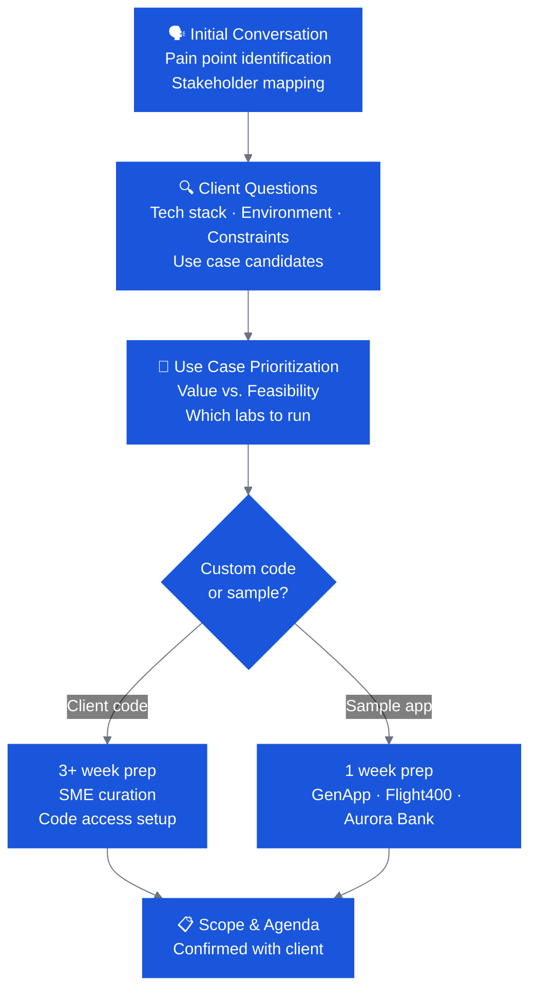

# Discovery & Scoping Overview

Discovery is where you translate a client's vague interest in AI tooling into a focused, deliverable Bobathon. It answers four questions:

1. **What problems are real?** — Which pain points have enough urgency and business impact to anchor the event?
2. **What use cases fit?** — Which Bob capabilities map to those pain points?
3. **What's the environment?** — Can we access the code? Are there install restrictions?
4. **What does success look like?** — How will the client know the Bobathon was worth their day?

---

## Discovery Workflow

---

## Key Sections

- :material-message-question: **[Client Discovery Questions](client-questions.md)**

    Structured question bank organized by SDLC area — use these to uncover pain points and inputs for the business value case.

- :material-tune: **[Scoping Decisions](scoping-decisions.md)**

    Work through the key decisions that shape the event: sample vs. client code, headcount, duration, format, and modernization goal.

- :material-whiteboard: **[Workshop (Mural)](workshop.md)**

    How to use the CE Bob Workshop Mural template for deeper discovery sessions with the client.

---

## What Good Discovery Produces

By the end of the discovery phase, you should have:

- [ ] 1–3 prioritized use cases with a clear "why this matters" statement
- [ ] Confirmed tech stack and code availability
- [ ] Known environment constraints (install rights, network, cloud account access)
- [ ] Named executive sponsor and their KPIs
- [ ] Proposed format and timing (half-day / full-day / 90-min)
- [ ] Identified CE staffing needs

Hand all of this to [Planning & Prep](../planning/index.md) and the [Bobathon Builder](../planning/build-with-bob.md).
