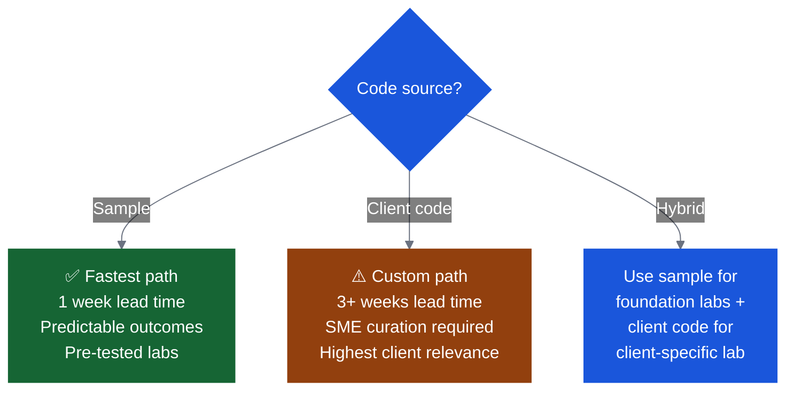
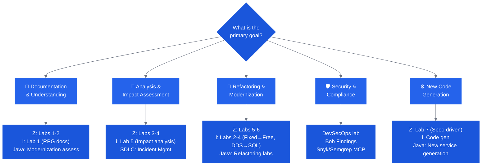

# Scoping Decisions

Work through these decisions in order before committing to a date or building materials.

---

## Decision 1: Sample Code or Client Code?

This is the most impactful decision you'll make. It determines lead time, preparation effort, and the day-of experience.

| Option | Best When | Lead Time | Risk |
|---|---|---|---|
| **Sample app** (GenApp, Flight400, Aurora Bank) | First Bobathon with a client; tight timeline; unknown codebase constraints | 1 week | Low |
| **Client code** | Client insists on their code; strong CE/SME support available; relevance is paramount | 3+ weeks | Medium |
| **Hybrid** | First labs on sample, client-specific lab on their code | 2–3 weeks | Low-Medium |

!!! tip "Recommendation for first events"
    Use the provided sample application. It's pre-tested, predictable, and still highly relevant — you can customize the narrative to the client's domain even when the code is a sample.

---

## Decision 2: Who Are the Participants?

| Participant Profile | Lab Approach |
|---|---|
| Hands-on developers (main audience) | All labs; deeper technical content; more time on hands-on |
| Architects / tech leads | Discovery, impact analysis, documentation labs; less hands-on coding |
| Executives / decision-makers | 90-min sprint format; demo-heavy; value framing over hands-on |
| Mixed | Split agenda; ensure at least some developers present for hands-on sections |

---

## Decision 3: How Many People?

| Headcount | Considerations |
|---|---|
| 4–10 | Ideal. One CE can manage. Single room, single track. |
| 10–15 | Manageable. Consider a second CE for support. |
| 15–20 | Multiple CE needed. Book larger room. Consider parallel tracks. |
| 20+ | Run parallel tracks by use case. 1 CE per breakout. One IBMer per ~10 clients. |

!!! warning "Plan for stragglers"
    Clients take **2–5x longer** than IBM practitioners to complete labs. Add buffer. Have a CE dedicated to helping slower participants rather than letting them fall behind.

---

## Decision 4: How Long Is the Event?

| Format | Total Time | Lab Time | Best For |
|---|---|---|---|
| **90-min Sprint** | 90 min | 30 min | Executive preview, value framing |
| **Half Day** | 3 hrs | ~90 min | Light enablement, 1–2 labs, intro |
| **Full Day** | 6–7 hrs+ | ~3 hrs+ | Multiple use cases, client-specific build |
| **4-hr Bobathon** *(Z standard)* | 4 hrs | 2.5 hrs | Z Premium Package standard |

!!! tip "Full-day events can run longer"
    When using client code, running multiple parallel tracks, or working with a larger group, full-day Bobathons routinely extend to 8 hours or more. Build buffer into the schedule and confirm the room and client availability accordingly.

---

## Decision 5: What Is the Modernization Goal?

Use this to select which adventure labs to run.

---

## Decision 6: Environment Path

| Environment | When to Use | Setup Time |
|---|---|---|
| **IBM Cloud Account** *(Recommended)* | Most enterprise clients; internet access available | ~10 min on the day |
| **Pre-configured VM** | Restricted / regulated / air-gapped environments | CE provides ahead of event |
| **CE-Provided Laptops** | Strict IT / no BYOD / install restrictions | Coordinate with CE well in advance |
| **TechZone** | As fallback for Z/i environments | 7+ days request, slow — avoid if possible |

---

## Decision 7: Use Case Track

Select the primary track based on the client's stack and discovery findings.

| Track | Premium Package | Sample App | Lab Repo |
|---|---|---|---|
| [IBM i](../labs/ibm-i.md) | ✅ PPi | Flight400 (Primary) / SAMCO | [Flight400 Lab](https://github.com/bmarolleau/flight400-demo) · [SAMCO Repo](https://github.ibm.com/ClientEngineering/bob/tree/main/LABs/IBM-i-Application-Modernization-with-Bob) |
| [Java Modernization](../labs/java.md) | ✅ Java | Aurora Bank / Insurance (WAS) | [CE Bob LABs](https://github.ibm.com/ClientEngineering/bob/tree/main/LABs) |
| [IBM Z](../labs/ibm-z.md) | ✅ pp4z | GenApp | [IBM-z-App-Modernization-with-Bob-Premium-For-z](https://github.ibm.com/ClientEngineering/bob/tree/main/LABs/IBM-z-App-Modernization-with-Bob-Premium-For-z) |
| [SDLC Workflows](../labs/sdlc.md) | — | FPL App / Bank App | [bob-a-thon-americas](https://github.ibm.com/WW-CE/bob-a-thon-americas) |
| [DevSecOps](../labs/other.md) | ✅ DevSecOps | DevSecOps-with-Bob lab | [CE Bob LABs](https://github.ibm.com/ClientEngineering/bob/tree/main/LABs/DevSecOps-with-Bob) |

---

## Scoping Output Checklist

Before moving to Planning, confirm you have:

- [ ] Code source decided (sample / client / hybrid)
- [ ] Participant profile and headcount confirmed
- [ ] Event format and duration agreed
- [ ] Modernization goal identified (1–2 primary goals)
- [ ] Environment path selected
- [ ] Use case track(s) chosen
- [ ] Lab selection shortlisted (see [Lab Menu](../labs/index.md))
- [ ] Executive sponsor and KPIs noted
- [ ] Lead time confirmed and dates under discussion
