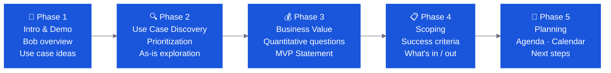

# CE Bob Workshop (Mural Template)

The **CE Bob Workshop** is a Mural-based facilitation template designed to support structured discovery and planning sessions with clients. It covers the full pre-Bobathon discovery arc.

🔗 **Access the template:** [https://ibm.biz/bob_ce_workshop](https://ibm.biz/bob_ce_workshop) *(IBM SSO required)*

---

## What the Workshop Covers

The template is organized into phases. You don't have to run all of them in a single session — pick the sections that match where you are with the client.

---

## Phase 1: Introduction & Demo

**Goal:** Introduce Bob, gauge initial interest, identify use case categories.

Activities included in template:
- Initial slides for context
- Exploration questions about the client's SDLC (see [Client Discovery Questions](client-questions.md))
- Optional: AI landscape questions to understand AI maturity

---

## Phase 2: Use Case Identification & Prioritization

**Goal:** Surface and prioritize the right use cases for the Bobathon.

Activities:
- **Suggested Use Cases** — pre-populated list of use case areas organized by category (documentation, modernization, testing, security, SDLC workflows, etc.)
- **Big Ideas** — free-form capture of ideas emerging from the conversation
- **Grouping** — cluster use cases that can be tackled together; map each cluster to a delivery format (Bobathon / Demo / Pilot / Out of scope)
- **Prioritization** — plot use cases on a **Value vs. Feasibility** matrix to identify No-Brainers and Big Bets

### Prioritization Matrix

*Illustrative example — replace with the client's actual use cases during the discovery session.*

| Quadrant | Label | Action |
|---|---|---|
| High Value · High Feasibility | **🚀 No-Brainers** | Start here — anchor the Bobathon around these |
| High Value · Low Feasibility | **🎲 Big Bets** | Challenge the feasibility assumption — often higher than first thought; strong pilot candidates |
| Low Value · High Feasibility | **🔧 Utilities** | Easy to do but limited impact — add only if time permits |
| Low Value · Low Feasibility | **🗄️ Save for Later** | Revisit when context changes |

---

## Phase 3: Business Value

**Goal:** Build the quantitative and qualitative business case.

Activities:
- **As-Is Scenario** — map the current state: steps, roles, data, systems, pain points
- **Business Value Questioning** — use the question bank by use case area (see [Client Discovery Questions](client-questions.md) for the full list)
- **MVP Statement** — crystallize the value case in one sentence:

    > *With [description], if we provide [users] a way to [capability], by measuring [metric], we will address the risk of [pain], and we know we've arrived if [target].*

!!! tip "Loop in Business Value Engineering"
    For large opportunities, bring in the BVE team for support on the quantitative business case. The template includes a reminder.

---

## Phase 4: Scoping

**Goal:** Define what's in scope for the Bobathon and how success is measured.

Activities:
- **Scope & Success Criteria** — capture in-scope functionality and client success metrics
- Confirm what's out of scope and what moves to the pilot

---

## Phase 5: Planning

**Goal:** Confirm the logistics and agree on next steps.

Activities:
- **Workshop Planning Canvas** — participants, goals, activities, deliverables, logistics, room setup
- **Sample Agendas** — Full Day (6–7hr), Half Day (3hr), 90-min Sprint
- **Calendar Planning** — 2–3 month calendar template: Demo → Bobathon → Office Hours → Pilot
- **Next Steps** — capture actions, owners, and dates

---

## Running a Discovery Session with the Template

**Recommended approach:**

1. **Pre-work:** Fill in what you know about the client before the session
2. **Session 1 (60–90 min):** Phases 1–2 — intro, use case exploration, prioritization
3. **Async:** CE completes preliminary scoping, drafts agenda options
4. **Session 2 (30–60 min):** Phases 3–5 — value quantification, scoping, planning sign-off

**One session is fine** if the client is already aligned — use Phases 2 and 5 only.

---

## Template Resources Linked Inside the Mural

The template includes direct links to:

- Bob-a-thon Americas Guide
- CE Bob Git repo
- Java Modernization Lab Top-Team Guide
- IBM i Modernization Lab Top-Team Guide
- SDLC Incident Management Lab Top-Team Guide
- Bob Field Demos Guide
- Bob ROI Calculator
- Quarterly Enablement Series (YourLearning)
