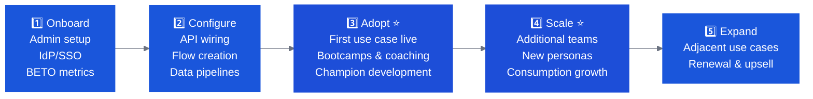

# Bobathons in the CVE Motion

A Client Value Engineer (CVE) is responsible for post-sale adoption and consumption of IBM SaaS products. Their portfolio spans products across observability, security, automation, and data — see the full list at [cve-resources/products](https://pages.github.ibm.com/WW-CE/cve-resources/products/).

A Bobathon in the CVE context is not about showcasing Bob — it is about getting a client's development team productive on an IBM SaaS product faster, using Bob as the activation mechanism.

!!! info "CVE Resource Hub"
    Full CVE operating model, cadences, and product playbooks: **[pages.github.ibm.com/WW-CE/cve-resources](https://pages.github.ibm.com/WW-CE/cve-resources)**

!!! note "Using this guide"
    This page covers the CVE-specific Bobathon playbook. For the full pre-event preparation workflow (environments, labs, logistics), use the same guide sections as CE and FDE — the CVE-specific differences are called out inline. Start with [Planning & Prep](../planning/index.md) and [Use Cases & Labs](../labs/index.md).

---

## Where a Bobathon Fits in the CVE Adoption Arc

The CVE moves accounts through a five-phase arc: **Onboard → Configure → Adopt → Scale → Expand**. A Bobathon is most relevant at two points:

| Phase | Bobathon role |
|---|---|
| **Adopt** | Primary fit. Client has the SaaS product but developers aren't using it. A targeted Bobathon on a real use case creates the first concrete win and builds internal champions. |
| **Scale** | Secondary fit. Activate new teams or personas who haven't engaged yet. A Bobathon brings the product to a new part of the organization without requiring the CVE to repeat the full onboarding arc. |
| **Get-Well Plan** | Intervention fit. When an account is Red or Yellow (consumption flat or declining), a focused Bobathon on one high-value use case can break the stalemate and restore momentum. |

---

## CVE Discovery: Is a Bobathon the Right Move?

Before proposing a Bobathon, the CVE should validate that the conditions are right. A Bobathon that runs on the wrong use case or with the wrong personas will fail to move Adoption Plan metrics.

### Qualification Checklist

- [ ] The client has completed **Onboard** and **Configure** phases — technical prerequisites are in place
- [ ] There is a **specific stalled use case** the development team was supposed to deliver but hasn't
- [ ] The audience is **technical** — developers, technical admins, or integration engineers (not business users or executives)
- [ ] The CVE can articulate **one deliverable** the team will have at the end of the session
- [ ] There is a **named champion** on the client side who will own follow-through after the event
- [ ] The session can be **tied to an open Adoption Plan milestone** in Gainsight

### CVE Discovery Questions

These questions map directly to the CVE adoption context — use them in the EBR or a dedicated scoping call:

| Question | Why it matters |
|---|---|
| "Which [product] use case was on your roadmap but hasn't launched yet?" | Identifies the stalled use case to anchor the Bobathon |
| "Who on your team is responsible for building that integration / configuration?" | Confirms technical personas; surfaces the right attendees |
| "What's blocking you — skills, time, or priorities?" | Determines if a Bobathon addresses the root cause |
| "What does a successful outcome look like for your team?" | Sets the deliverable expectation before the event |
| "Have you used Bob before, or is this a first exposure?" | Shapes the onboarding and lab design for the day |

If the client can't answer the first two questions, the Bobathon is not ready to scope. Run a discovery call first.

---

## Format: Right-Sizing the CVE Bobathon

CVE Bobathons follow the same format options as CE Bobathons — scale to what the client's team can commit to:

| Format | Duration | Best for |
|---|---|---|
| **Targeted Sprint** | 90 min – 2 hrs | One specific integration task; small team (2–5 developers); account in get-well status where a quick win is needed |
| **Half Day** | 3–4 hrs | Single focused use case; standard for Adopt-phase interventions; 4–10 developers |
| **Full Day** | 6–7 hrs | Multiple related use cases (e.g., Instana sensor + alert integration + SIEM connector); Scale-phase activation of a new team |

!!! tip "Default to half-day for first CVE Bobathons"
    A half-day is the lowest-friction entry point. It's easier to get client commitment, easier to scope to one deliverable, and easier to tie to a single Adoption Plan milestone. Expand to a full day only when a second use case is clearly scoped and owned.

---

## The Key Distinction: Bob Accelerates the Focus Product

When a CVE runs a Bobathon, the headline is **the SaaS product the client paid for**, not Bob. Bob is the tool that makes the session interactive and productive. The framing matters:

| ❌ Wrong framing | ✅ Right framing |
|---|---|
| "Let's do a Bob workshop" | "Let's spend a day getting your team productive on [product]" |
| "Bob can help you write scripts" | "Bob accelerates the integration work your team is already trying to do in [product]" |
| "Here's what Bob can do" | "Here's your first working [artifact] — Bob helped us build it in 2 hours" |

The deliverable the client walks away with should be a **working artifact on the focus product** — not a Bob demo.

---

## Products Where This Works Best

Bob's value as an accelerator is highest where the focus product requires custom code, configuration work, or integration development. The CVE portfolio products where a Bobathon makes the most sense:

| Product | How Bob accelerates adoption |
|---|---|
| **Instana** | Custom sensor development, Smart Alert scripts, SIEM/SOAR integration connector code, Application Perspective configuration |
| **Guardium** | Universal connector configuration code, SIEM/SOAR integration scripts, policy automation, compliance report generation |
| **CP4BA / Automation** | Business automation script generation, ODM decision table authoring, AI agent integration adapters, test case generation |
| **watsonx Orchestrate** | Skill and agent development, automation flow scripting, API connector code |
| **Concert** | Integration configuration, data pipeline wiring, custom connector code |
| **watsonx.data** | SQL query generation, Presto/Spark notebook scaffolding, data pipeline scripts |
| **Planning Analytics** | TM1 rules and process scripting, Turbo Integrator automation, data load and transformation scripts |
| **webMethods** | Integration flow scripting, API adapter code, connector configuration |
| **Turbonomic** | Automation policy scripts, API integration code, custom action generation |

See the full CVE product catalog at [cve-resources/products](https://pages.github.ibm.com/WW-CE/cve-resources/products/) — Bob can accelerate adoption on any product where the client's team is writing code, scripts, or configuration.

---

## How to Run a CVE-Focused Bobathon

### Before the Session

1. **Identify the stalled use case** — work with the client lead to pick one specific thing the team was supposed to build but hasn't. This is the Bobathon's target.
2. **Confirm the personas** — developers, technical admins, or integration engineers are the right audience. Executives and business users are not.
3. **Pre-configure Bob for the focus product** — install any relevant Marketplace modes (e.g. Instana observability mode or security modes for Guardium), connect MCP servers to the client's environment, confirm Bob IDE is installed and authenticated.
4. **Set the outcome expectation** — "By end of today, you will have a working [artifact] in [product]." Make it specific and completable.

### During the Session

- Lead with the **focus product** — open the product, show the target use case, explain what needs to be built.
- Bring in Bob as the build accelerator — not the featured attraction. "Let's use Bob to write this skill faster."
- Use the [SDLC labs](../labs/sdlc.md) or [Java](../labs/java.md)/[IBM i](../labs/ibm-i.md)/[Z](../labs/ibm-z.md) tracks only if the client's developers are working on code that feeds the focus product.
- Keep the session anchored to **one deliverable** — a partial win is better than a wide-ranging demo that produces nothing reusable.

### After the Session

- Log the Bobathon as a **technical activity in Gainsight** (via ISC) within 24 hours — tied to the account's Adoption Plan.
- Capture the artifact built and link it from the account's Adoption Plan milestones.
- Update the **BETO outcome metric** — the Bobathon should move a specific milestone (e.g. "First Instana Smart Alert pipeline deployed" or "Guardium SIEM integration code complete and tested").
- If Bobcoin consumption increased during/after the session, flag it as a positive signal in the account health review.

---

## Coordination with CE and FDE

Before planning a CVE Bobathon, align with the other roles active on the account and agree who owns what. Duplication wastes time; a coordinated session is almost always more effective than parallel ones.

| Scenario | Who to involve | Why |
|---|---|---|
| Account also has an active CE pre-sales engagement | CE Lead | Agree on sequencing — CE pre-sales Bobathon and CVE post-sale Bobathon should not run concurrently on the same team |
| Client needs a new Bob environment provisioned or a Premium Package configured | CE or FDE | CVEs don't provision TechZone — request CE/FDE support for environment setup if the client doesn't have one |
| Client team is new to Bob entirely | CE | Consider requesting CE co-facilitation for the Bob onboarding segment; CVE owns the product narrative |
| FDE is already embedded with the client team | FDE | Coordinate so the CVE Bobathon extends FDE Motion 2 or 3 — don't run a parallel engagement |
| Client is in a get-well / Red account status | CE Manager + Sales | Loop in the CE Manager and account executive before proposing a Bobathon — align on the recovery narrative |

**Quick check:** Before booking the Bobathon, confirm with CE/FDE:
- Has this client team already done a Bobathon? If yes, what was built, and what's the continuation story?
- Is there an active FDE motion? If yes, the CVE Bobathon should be framed as an extension of that work, not a separate event.
- Is there an active CE pre-sales engagement? If yes, the CVE should wait until post-close or coordinate timing carefully.

---

## Measuring Success in the CVE Context

The CVE measures success through **Bobcoin consumption trends** (for Bob itself) and **Adoption Plan milestone completion** (for the focus product). A Bobathon should move at least one milestone.

| Signal | What it means |
|---|---|
| Bobcoin spend increases week-over-week after the Bobathon | Developers are using Bob independently — adoption is self-sustaining |
| Focus product consumption increases after the Bobathon | The artifact built is being used in production workflows |
| Adoption Plan milestone closes | The Bobathon delivered its stated outcome |
| No change in either metric after 2 weeks | The Bobathon didn't land — diagnose: wrong personas? Wrong use case? Unresolved blocker? |

---

## Further Reading

| Resource | Link |
|---|---|
| CVE Resource Hub | [pages.github.ibm.com/WW-CE/cve-resources](https://pages.github.ibm.com/WW-CE/cve-resources) |
| CVE Bob product page | [cve-resources/products/bob](https://pages.github.ibm.com/WW-CE/cve-resources/products/bob/) |
| CVE SaaS Adoption Workflow | [cve-resources/cve-cadences/saas-adoption-workflow](https://pages.github.ibm.com/WW-CE/cve-resources/cve-cadences/saas-adoption-workflow/) |
| CE Bob Workshop (Mural) | [ibm.biz/bob_ce_workshop](https://ibm.biz/bob_ce_workshop) |
| FDE Engagement Motions | [pages.github.ibm.com/WW-CE/fde-resources/engagement-motions](https://pages.github.ibm.com/WW-CE/fde-resources/engagement-motions/index/) |
