# Post-Event Activities

The Bobathon is not the finish line — it's the decision point. The preferred outcome is moving straight to a proposal or adoption. A pilot is a tool, not a required step.

---

## Choose the Right Next Step

!!! success "Default: skip the pilot if the Bobathon builds conviction"
    When a Bobathon runs on the client's real code and the team leaves with working capability, the client may have enough confidence to adopt without a pilot. **A pilot exists to build conviction — if the Bobathon already did that, go straight to a proposal.** Only run a pilot when you still need to close a specific evidence gap.

```mermaid
%%{init: {'theme': 'base', 'themeVariables': {'primaryColor': '#1a56db', 'primaryTextColor': '#ffffff', 'primaryBorderColor': '#1a56db', 'lineColor': '#6b7280', 'mainBkg': '#1a56db', 'nodeBorder': '#1a56db', 'clusterBkg': '#1e3a5f', 'titleColor': '#ffffff', 'edgeLabelBackground': 'transparent'}}}%%
flowchart TD
    A{\"Bobathon outcome?\"}

    A -->|\"Strong signal\\nConviction established\\nReady to commit\"| B[\"📄 ✅ PREFERRED\\nMove to Proposal\\nBuild commercial case\\nEngage sales team\"]
    A -->|\"Interest but not ready\\nNeed more exploration\\nNo sponsor yet\"| C[\"☕ Office Hours\\nWeekly drop-in support\\nCE · pre-sales\"]
    A -->|\"Conviction gap remains\\nSpecific evidence needed\\nPre or post-sales\"| D[\"🚀 Pilot / PoC (if needed)\\n2–3 wks target · 2–6 wk range\\nCE · FDE · CVE\"]

    classDef node fill:#1a56db,color:#fff,stroke:#1a56db
    classDef success fill:#166534,color:#fff,stroke:#166534
    classDef secondary fill:#2563eb,color:#fff,stroke:#2563eb
    classDef highlight fill:#1d4ed8,color:#fff,stroke:#1d4ed8,stroke-width:3px
    classDef warning fill:#92400e,color:#fff,stroke:#92400e
    classDef decision fill:#1e40af,color:#fff,stroke:#1e40af
    class A decision
    class B success
    class C node
    class D highlight
```

!!! info "Who runs what — CE, FDE, CVE"
    Bobathons and pilots are not locked to a sales stage or role. The right practitioner depends on the engagement context:
    - **CE:** Pre-sales only — co-creation, qualification, bootcamps, and pilots. Primary Bobathon owner. Hands off to FDE/CVE at close.
    - **FDE:** Post-sales only — onboards committed customers, activates stalled seats, runs PoCs to validate and extend usage. See **[FDE Motions](https://pages.github.ibm.com/WW-CE/fde-resources/engagement-motions/index/)**.
    - **CVE:** Post-sale adoption. Uses Bobathons to accelerate value realization on focus SaaS products — see **[Bobathons in the CVE Motion](cve.md)**.
    - Full FDE model: **[FDE Resource Hub](https://pages.github.ibm.com/WW-CE/fde-resources)**

---

## Path 1: Move to a Proposal

**When:** Strong executive buy-in, clear ROI story from the Bobathon, client is asking "how do we get started?"

**Who drives it:** CE + IBM sales team

This is the fastest path and the highest-value outcome. Don't wait for a pilot if the conditions are right — move directly to a commercial proposal built on Bobathon data.

!!! tip "A good Bobathon can skip the pilot"
    When the Bobathon runs on the client's real code and the team leaves with working capability, the client may have enough conviction to adopt without a pilot. A pilot exists to build conviction — if the Bobathon already did that, the pilot is optional. See [Pilot & PoC Guide](pilot.md#same-work-different-objectives) for the full pre/post-sales objective breakdown.

**What you need:**
- BVA data collected at the Bobathon (even rough estimates are sufficient)
- Named executive sponsor with budget authority
- Bobathon debrief notes — use cases proven, developer reactions, blockers resolved

**Actions:**
1. Brief your IBM sales counterpart within 24 hours of the Bobathon
2. Use the Week 1 follow-up call to qualify: budget, timeline, decision process
3. Build the proposal using the [Pilot & PoC Guide → Commercial Proposal](pilot.md#transitioning-to-a-commercial-proposal) framework
4. Loop in Business Value Engineering for large or strategic accounts

---

## Path 2: Office Hours (Pre-Sales, CE-Led)

**When:** Client showed genuine interest but isn't ready to commit. They want to keep testing Bob on their own challenges before a formal proposal.

**Who drives it:** CE lead, supported by the broader CE team

**CE motion context:** Pre-sales office hours are the continuation of **[FDE Motion 1 — Win the Developers](https://pages.github.ibm.com/WW-CE/fde-resources/engagement-motions/motion-1/)** — extended validation before a license decision. Post-sales, the FDE takes over: if office hours are needed to unblock stalled seat adoption after purchase, that is **[Motion 2 — Embedded Activation](https://pages.github.ibm.com/WW-CE/fde-resources/engagement-motions/motion-2/)** and the FDE owns it.

Office hours are informal, low-overhead, and high-value. The goal is to keep Bob visible, help the client's developers succeed on real work, and surface the blockers preventing a purchase decision.

### Format

| Element | Detail |
|---|---|
| **Frequency** | Weekly or bi-weekly, 60 minutes |
| **Attendance** | Optional for client — encourage developers and at least one tech lead |
| **Format** | Video call; CE shares screen for demos; open Q&A |
| **Duration** | Typically 4–8 sessions before a decision point |

### Agenda (per session)

1. **What have you tried since last time?** (15 min) — celebrate wins, diagnose blockers
2. **Live demo / deep dive** (20 min) — pick one Bob capability relevant to the client's current backlog
3. **Hands-on time** (15 min) — client tries it with CE support
4. **Next steps** (10 min) — specific challenge for the client to tackle before next session

### What to Track

Keep a running log of:
- Use cases attempted and outcomes
- Blockers raised (technical, organisational, procurement)
- Quotes and reactions — these feed the business case

!!! tip "When to escalate from office hours to a proposal"
    If after 3–4 sessions a developer is using Bob independently on real work, escalate the conversation. That's the signal. Ask: *"You've proven this works — what would it take to make this official?"*

---

## Path 3: Pilot (Pre or Post-Sales)

**When:** A conviction gap remains after the Bobathon — you need structured, KPI-tracked evidence before a proposal or deployment decision. This applies at any stage:

| Pilot type | Stage | Goal |
|---|---|---|
| **Pre-sales pilot** | Pre-sale | Prove business value; generate a Path to Production; close the license decision |
| **Post-sales PoC** | Post-sale | Validate the technology works in the client's production-adjacent environment; extend usage to new teams |
| **FDE Scaled Pilot** | Post-sale | Take one real use case to user acceptance within 60 days |

**Who drives it:** CE typically drives pre-sales pilots. FDEs and CVEs may run pilots or PoCs at any stage depending on account context. CVE-led PoCs are tied to Adoption Plan milestones rather than license decisions.

**FDE motion context:** A 2–3 week pilot maps to the **Embed phase** of the FDE Deployment Arc. A PoC taken to user acceptance within 60 days is **[Motion 3 — Scaled Pilot](https://pages.github.ibm.com/WW-CE/fde-resources/engagement-motions/motion-3/)**. See the full **[FDE Deployment Arc & Gates](https://pages.github.ibm.com/WW-CE/fde-resources/fde-cadences/deployment-arc/)**.

A pilot is more formal than office hours. It has defined scope, measurable KPIs, and a structured cadence. The Bobathon artifacts and debrief notes are the inputs.

See **[Pilot & PoC Guide](pilot.md)** for the full structure, cadence, and BVA framework. For CVE-specific PoC context, see **[Bobathons in the CVE Motion](cve.md)**.

**Pilot vs. office hours:**

| | Office Hours | Pilot / PoC |
|---|---|---|
| **Who runs it** | CE | CE · FDE · CVE |
| **Stage** | Any — flexible entry | Proof, PoC, or validation — depends on role and account context |
| **Client commitment** | Exploring | Conviction gap to close; KPIs agreed upfront |
| **Duration** | Open-ended | **2–3 weeks** target (2–6 week range); up to 60 days for FDE Scaled Pilot |
| **Output** | Evidence direction | Business Value Assessment + proposal or deployment decision |
| **Cadence** | Flexible | Weekly office hours + executive playbacks |
| **FDE motion** | Motion 1 or Motion 2 | Motion 2 (Activation), Motion 3 (Scaled Pilot), or Embed phase |

---

## Path 4: CVE Adoption Motion (Post-Sale)

**When:** A client already owns an IBM SaaS product but adoption is flat, stalled, or limited to one team. The CVE uses a Bobathon to activate the development team and close an Adoption Plan milestone.

**Who drives it:** CVE, supported by CE or FDE for facilitation

**CVE motion context:** This is a post-sale motion — the client has purchased the product. The Bobathon is not about proving Bob; it is about getting the client productive on the SaaS product faster. Bob is the build accelerator.

| Fit | When to use |
|---|---|
| **Adopt phase** | Client has the product but developers aren't using it — a targeted Bobathon on one real use case creates the first concrete win |
| **Scale phase** | Activate a new team or persona that hasn't engaged — brings the product to a new part of the organization without repeating full onboarding |
| **Get-Well intervention** | Account is Red or Yellow (consumption flat or declining) — a focused Bobathon on one high-value use case can break the stalemate |

!!! info "CVE Adoption Motion — full guide"
    See **[Bobathons in the CVE Motion](cve.md)** for the complete CVE playbook: product fit, session structure, Gainsight logging, BETO outcome tracking, and success signals.

---

## Immediate Actions (Within 24–48 Hours)

Regardless of which path you take, these happen immediately after every Bobathon:

### 1. Send Follow-Up Email

!!! info "First Draft — Customize before sending"

```
Subject: Thank you — [Client Name] Bobathon [Date] — Artifacts & Next Steps

Hi [Name],

Thank you for a great Bobathon yesterday! Here's everything from the session:

📁 ARTIFACTS
• Lab guide: [link]
• Generated outputs / working prototype: [link]
• Recording (if made): [link]
• Session notes: [link]

📊 SURVEY
Please take 5 minutes to complete our feedback survey — your input directly shapes
how we improve future sessions and helps us build the case for continued investment:
[survey link]

📅 NEXT STEPS
• [Action 1] — Owner: [Name] — Due: [Date]
• [Action 2] — Owner: [Name] — Due: [Date]
• Follow-up call: [proposed date/time]

We're excited about what we built together. Looking forward to the next conversation.

[CE Lead Name] | IBM Client Engineering
```

### 2. Complete Debrief Notes

Fill in and share the debrief notes with:
- CE team internal sync within 24 hrs
- Client lead shared artifact within 48 hrs

Include: what worked, what didn't, which use cases landed, developer reactions, and a clear recommendation for next steps (Proposal / Office Hours / Pilot).

### 3. Log in ISC

**Log the Bobathon as a timeline activity in ISC (Gainsight) within 24 hours**, tied to the open opportunity. If it's not in the system, it didn't happen — this is a CE requirement, not a suggestion.

### 4. Issue Badges (Within 24 Hours)

Log into the [badge portal](https://bob-badge-portal.ce.techzone.ibm.com/), review submissions, approve, and issue. Send the claim notification email within 24 hours — claim rates decay sharply after 72 hours. See [Badging Setup](../planning/badging.md).

### 5. Business Value Check-In

If business value tracking was enabled, send the end-of-Bobathon survey. The goal is to capture **immediate reactions before memory fades**.

---

## Week 1: Keep the Momentum

### Schedule the Follow-Up Call

Book a 30–45 minute call with the client lead and at least one technical attendee within 5 business days. The purpose of this call is to agree which path you're on.

**Agenda:**
1. Reactions and reflections since the event (10 min)
2. Business value conversation — what did you observe? (10 min)
3. Blockers to adoption — what would need to be true for your team to use Bob regularly? (10 min)
4. **Agree next step: Proposal / Office Hours / Pilot** (10 min)

!!! warning "Don't leave without a date"
    Book the follow-up call **before you leave the room** on the day of the Bobathon. A verbal commitment in the room is worth more than ten unanswered follow-up emails.

---

## Post-Event Timeline

```mermaid
%%{init: {'theme': 'base', 'themeVariables': {'primaryColor': '#1a56db', 'primaryTextColor': '#ffffff', 'primaryBorderColor': '#1a56db', 'lineColor': '#6b7280', 'mainBkg': '#1a56db', 'nodeBorder': '#1a56db', 'clusterBkg': '#1e3a5f', 'titleColor': '#ffffff', 'edgeLabelBackground': 'transparent'}}}%%
gantt
    title Post-Bobathon Follow-Up Timeline
    dateFormat  D
    axisFormat  Day +%d

    section Immediate (24–48 hrs)
    Send follow-up email with artifacts   :done, f1, 1, 1d
    Complete debrief notes                :done, f2, 1, 1d
    Review badge submissions              :done, f3, 1, 1d
    Submit CE engagement feedback         :f4, 1, 2d

    section Week 1
    Follow-up call · agree next path      :f5, 3, 4d
    Brief IBM sales (if Proposal path)    :f6, 3, 2d
    Business value survey reminder        :f7, 4, 1d

    section Week 2 onward (path-dependent)
    Office hours session 1 (if OH path)   :f8, 8, 1d
    Pilot kickoff (if Pilot path)         :f9, 8, 1d
    Proposal draft (if Proposal path)     :f10, 7, 5d
```



---

## Success Criteria

### Immediate (End of Bobathon)
- [ ] All attendees can independently use Bob for at least one basic task
- [ ] Team completed at least one client-specific use case
- [ ] Attendees understand how to get help and support
- [ ] Positive feedback from participants (>4/5 average rating)
- [ ] Clear action plan for Bob adoption post-Bobathon
- [ ] **Next step agreed and dated before leaving the room**

### Short-Term (1–2 weeks)
- [ ] Follow-up call completed; next path confirmed
- [ ] Sales team briefed (if Proposal path)
- [ ] Office hours cadence established (if Office Hours path)
- [ ] Pilot scope agreed (if Pilot path)
- [ ] At least one attendee using Bob independently on their own backlog

### Long-Term (1 month)
- [ ] Proposal submitted or pilot agreement in place
- [ ] Business value KPIs defined and baseline captured
- [ ] Executive sponsor briefed on Bobathon outcomes and next steps

---

## Measuring Business Value

Business value tracking is the foundation of any next step. Start collecting data immediately after the Bobathon.

| Metric | How to Measure |
|---|---|
| Time savings | Hours saved per week — survey before/after comparison |
| Quality improvements | % bugs caught; code consistency rating |
| Security enhancements | Vulnerabilities prevented / remediated |
| Cost savings | $ saved per month (use developer hourly rate × hours saved) |
| Adoption rate | % of team using Bob regularly at 2, 4, 8 weeks post-event |
| Ease of use | 1–5 scale rating |
| Likelihood to adopt | 1–5 scale NPS-style question |

**Survey timing:**
1. **End of Bobathon** — immediate reactions
2. **2 weeks post** — initial adoption patterns
3. **4–6 weeks post** — actual results and habit formation

---

## Common Follow-Up Pitfalls

| Pitfall | Prevention |
|---|---|
| No follow-up call booked before leaving the room | Book the call **at the debrief** — don't leave without a date |
| Path not agreed — drifting between office hours and proposal | Make a clear recommendation at the Week 1 call; get explicit agreement |
| Artifacts never shared | Send the follow-up email within 24 hours while it's still top of mind |
| Survey response rate too low | Send survey link *before* people leave the room (QR code on screen) |
| Pilot conversation stalls | Bring the executive sponsor in early; their buy-in breaks logjams |
| CE/FDE ownership unclear | Agree in the debrief notes which team owns the next phase and what the trigger is for hand-off |
| No business value data | Start the conversation at the debrief: *"What would you need to see to justify ongoing investment?"* |
