# Pilot & PoC Guide

The work of running a pilot looks similar regardless of context — scoped use case, weekly cadence, KPIs, executive playback. **The objectives are different.** Understanding which objective you're serving determines how you frame the engagement, what success looks like, and what you do when it's done.

**Not every Bobathon needs a pilot.** If the Bobathon built enough conviction, skip the pilot and go straight to a proposal.

---

## Same Work, Different Objectives

| | **Pre-Sales Pilot** | **Post-Sales PoC / Pilot** |
|---|---|---|
| **Who runs it** | CE | FDE |
| **Client state** | Evaluating — hasn't purchased | Purchased or committed to adoption |
| **Objective** | Prove business value; generate a Path to Production; close the license decision | Validate the technology in the client's environment; onboard a committed team; extend usage to new teams |
| **Success signal** | Client moves to commercial proposal | Client team is self-sufficient; usage extends; PoC artefact moves toward production |
| **What you hand off** | Business case + proposal to account team / FDE / CVE | Working PoC + scaling plan to FDE / CVE / Expert Labs |
| **Typical duration** | 2–3 weeks (target); up to 6 | 2–6 weeks for PoC; up to 60 days for FDE Scaled Pilot |
| **FDE motion** | Motion 1 — Win the Developers | Motion 2 (Activation) or Motion 3 (Scaled Pilot) |

The same is true for **Bobathons**:

| | **Pre-Sales Bobathon** | **Post-Sales Bobathon** |
|---|---|---|
| **Objective** | Build developer conviction; prove Bob works on the client's stack; generate interest in a pilot or proposal | Activate stalled seats; onboard a new team; unblock a skills gap; extend usage to a new persona |
| **Outcome** | Functional prototype + pilot proposal or direct proposal | Developers independently using Bob; champion identified; adoption plan milestone closed |
| **Who drives it** | CE | FDE (Motion 2) or CVE (focus product adoption) |
| **Pilot needed?** | Only if conviction gap remains | Only if PoC validation is needed for a new use case |

!!! info "FDE Engagement Motions"
    - 2–3 week pilot = **Embed phase** of the [FDE Deployment Arc](https://pages.github.ibm.com/WW-CE/fde-resources/fde-cadences/deployment-arc/)
    - Use case to user acceptance within 60 days = **[Motion 3 — Scaled Pilot](https://pages.github.ibm.com/WW-CE/fde-resources/engagement-motions/motion-3/)**
    - Post-sales activation / stalled seat adoption = **[Motion 2 — Embedded Activation](https://pages.github.ibm.com/WW-CE/fde-resources/engagement-motions/motion-2/)**
    - Full FDE model: **[FDE Resource Hub](https://pages.github.ibm.com/WW-CE/fde-resources)**

---

## The Pilot Structure

CE pilots are scoped for speed — the range is **2–6 weeks**, with a strong bias toward **2–3 weeks**. A pilot that cannot close within 3 weeks is usually scoped too wide. Cut scope before extending time.

!!! tip "A well-run Bobathon can skip the pilot entirely"
    When a Bobathon runs against the client's real codebase or a close equivalent and the team leaves with hands-on capability and a clear use case, the client may have enough confidence to move directly to adoption — bypassing the pilot phase. A pilot exists to build conviction; if the Bobathon already does that, the pilot becomes optional. Move straight to a proposal.

```mermaid
%%{init: {'theme': 'base', 'themeVariables': {'primaryColor': '#1a56db', 'primaryTextColor': '#ffffff', 'primaryBorderColor': '#1a56db', 'lineColor': '#6b7280', 'mainBkg': '#1a56db', 'nodeBorder': '#1a56db', 'clusterBkg': '#1e3a5f', 'titleColor': '#ffffff', 'edgeLabelBackground': 'transparent'}}}%%
gantt
    title CE Bob Pilot Structure (2–3 Week Target)
    dateFormat  W
    axisFormat  Week %W

    section Kickoff
    Pilot kickoff · Scope & KPIs       :done, p1, 1, 1d

    section Weekly Cadence
    Office hours · Week 1              :p2, 1, 1d
    Office hours · Week 2              :p3, 2, 1d
    Office hours · Week 3 (if needed)  :p4, 3, 1d

    section Playbacks
    Executive Playback #1 · Week 2     :crit, p6, 2, 1d
    Executive Playback #2 · Week 3     :crit, p7, 3, 1d

    section Output
    Business Value Assessment          :p8, 3, 1d
    Pilot Proposal / Quote             :p9, 3, 1d
```



---

## Pilot Components

### Weekly Office Hours (60 min each)
- Open Q&A and unblocking
- Live demo of new capabilities relevant to client's current backlog
- Review of adoption and usage patterns
- Check-in on business value KPIs

### Executive Playbacks
- **Week 2:** Progress update — what's been built, early wins, blockers
- **Week 3 (or final week):** Full results — KPI performance, productivity data, TCO comparison, recommendation

**Final Playback Agenda:**
1. What we set out to prove (scope recap)
2. What Bob did (demos of key outputs)
3. Business value realized (KPI data)
4. Developer feedback (survey results, quotes)
5. Recommendation (continue / expand / productize)
6. Commercial proposal

### Business Value Assessment (BVA)
The BVA is the quantitative foundation of the commercial proposal. It requires:

| Input | Source |
|---|---|
| Developer hourly rate (fully loaded) | Client HR / finance |
| Hours per week on target tasks (before Bob) | Baseline survey at Bobathon |
| Hours per week on target tasks (with Bob) | Pilot survey at week 2 and final week |
| Developer count in scope | Client |
| Incidents / bugs per period | Client metrics |
| Time to remediate | Client metrics |

!!! tip "Loop in Business Value Engineering"
    For large or strategic opportunities, bring in the BVE team to run the formal BVA. The Bobathon data and debrief notes are your inputs.

---

## Pilot Scope Template

!!! info "First Draft"
    Customize with client-specific use cases and KPIs. This is a conversation starter, not a binding document.

```markdown
# [Client Name] Bob Pilot Scope — Draft

## Objective
Validate that IBM Bob delivers measurable productivity and quality improvements
for [Client Name]'s [team/squad] working on [use case area].

## Duration
2–3 weeks (target) · [Start Date] → [End Date]
<!-- Range 2–6 weeks; scope to fit 2–3. Cut scope before extending time. -->

## Participants
[N] developers from [team name]
Roles: [list]

## Use Cases in Scope
1. [Use Case 1 — e.g., Java modernization of legacy batch services]
2. [Use Case 2 — e.g., Test generation for untested modules]

## KPIs
| Metric | Baseline (Bobathon) | Target (Pilot) |
|---|---|---|
| Time per documentation task | [X hrs] | 50% reduction |
| Test coverage | [X%] | +20% |
| Developer satisfaction | [X/5] | >4/5 |

## Cadence
- Weekly office hours: [Day/Time]
- Executive playbacks: Week 2 and final week (Week 3 target)

## Deliverables
- Working prototype(s) from each use case
- Business Value Assessment at week 4
- Recommendation for production licensing

## Out of Scope
- Production deployment
- [Other explicit exclusions]
```

---

## FDE Engagement Motions Reference

The Bobathon and pilot fit into the FDE engagement model across multiple motions — both pre-sale and post-sale:

| FDE Motion | Duration | Stage | How Bobathons / pilots fit |
|---|---|---|---|
| **[Motion 1 — Win the Developers](https://pages.github.ibm.com/WW-CE/fde-resources/engagement-motions/motion-1/)** | 2–4 weeks | Pre-sales | The Bobathon **is** Motion 1. A follow-on pilot closes the evidence gap and enables the license decision. |
| **[Motion 2 — Embedded Activation](https://pages.github.ibm.com/WW-CE/fde-resources/engagement-motions/motion-2/)** | 1–2 months | Post-sales | Bobathons unblock stalled seat adoption. A post-sales PoC validates the technology in a new team's environment and extends usage. |
| **[Motion 3 — Scaled Pilot](https://pages.github.ibm.com/WW-CE/fde-resources/engagement-motions/motion-3/)** | Up to 60 days | Design → Deploy | A 2–3 week pilot is the entry point. Motion 3 takes one use case all the way to user acceptance — the PoC becomes a production-ready artefact. |

See also: [FDE Deployment Arc & Gates](https://pages.github.ibm.com/WW-CE/fde-resources/fde-cadences/deployment-arc/) — the 3-phase (Embed → Build → Transfer) lifecycle for FDE engagements.

---

## Transitioning to a Commercial Proposal

After the pilot, the commercial path typically follows one of these routes:

| Path | Trigger |
|---|---|
| **IBM Bob SaaS** | Client adopts Bob under standard licensing |
| **Enterprise agreement** | Large team / multi-department adoption |
| **Custom engagement** | Ongoing CE co-creation with dedicated support |
| **Premium Package upsell** | Client on base Bob wants Z, i, Java, or DevSecOps Premium |

The proposal is built on:
1. BVA data from the pilot
2. Pilot scope and outcomes
3. Executive playback findings
4. Client's stated next priorities

---

## Key Messages for the Pilot Conversation

- **"The Bobathon proved it works on your stack. The pilot proves it works for your team."**
- **"No cost for the pilot — CE engagement model."** (confirm with CE manager for your engagement)
- **"We define the KPIs together upfront — you judge the success."**
- **"Every artifact you build during the pilot is yours to keep."**
- **"The pilot is the on-ramp to a commercial proposal — but there's no obligation."**
