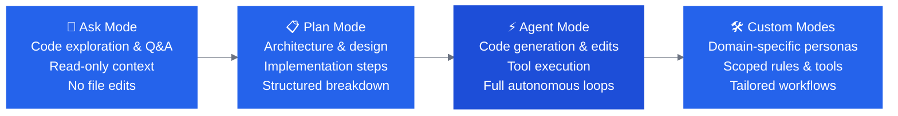

# IBM Bob — OpenSlava Bobathon

Welcome to the **IBM Bob Hands-On Workshop** at OpenSlava!

This portal is your complete guide for the 90-minute session. Choose your track below, follow the step-by-step instructions, and build real applications and workflows with IBM Bob.

---

## Quick Start — Choose Your Track

Select the track that best matches your background and goals:

-   :material-numeric-1-circle:{ .lg .middle } __[🟢 Beginner Track](labs/openslava-beginner.md)__

    ---

    **~70 minutes · 3 Labs · No prior Bob experience needed**

    * **B1 (25m):** Discover **Ask**, **Plan**, and **Agent** modes by building the OpenSlava 2026 Welcome App with confetti.
    * **B2 (25m):** Add layover support to the full-stack **Galaxium Travels** app.
    * **B3 (20m):** Implement date pickers, price ranking, and mock AI booking agents.

    [:octicons-arrow-right-24: Start Beginner Track](labs/openslava-beginner.md)

-   :material-numeric-2-circle:{ .lg .middle } __[🟡 Intermediate Track](labs/openslava-intermediate.md)__

    ---

    **~70 minutes · 2 Labs · Basic Bob familiarity assumed**

    * **I1 (40m):** End-to-end SDLC loop with **GitHub MCP** — Issue → Branch → Code → Test → PR.
    * **I2 (30m):** Author, test, and commit custom project rules (`.bob/rules/`) for team standards.

    [:octicons-arrow-right-24: Start Intermediate Track](labs/openslava-intermediate.md)

-   :material-numeric-3-circle:{ .lg .middle } __[🔴 Expert Track](labs/openslava-expert.md)__

    ---

    **~90 minutes · 4 Labs · For power users and architects**

    * **E1 (25m):** GFM Core Bank — Architecture discovery, React UI build, and security audit.
    * **E2 (20m):** `/init`, project rules, and fintech compliance governance.
    * **E3 (20m):** Custom modes with scoped rules and tool permissions (`fintech-reviewer`).
    * **E4 (25m):** Full SDLC automation with GitHub MCP.

    [:octicons-arrow-right-24: Start Expert Track](labs/openslava-expert.md)

---

## Workshop Architecture & Modes

IBM Bob operates across dedicated modes optimized for each phase of software development:

---

## Prerequisites & Setup

Before starting any lab, verify you have the essentials ready:

1. **VS Code** with the **IBM Bob extension** installed and logged in.
2. **Node.js 20 LTS** & **Python 3.11+** installed on your workstation.
3. **Git** configured (`user.name` and `user.email`).
4. **Workshop Starter Repositories:**
    * **Galaxium Travels:** Clone with `git clone https://github.com/IBM/galaxium-travels`
    * **Workshop Materials & GFM Bank:** Available directly inside this repository.

---

## Lab Tracks Summary

| Track | Level | Key Focus Areas | Duration |
|---|---|---|---|
| [**Beginner**](labs/openslava-beginner.md) | 🟢 Introductory | Modes overview, full-stack React/Node feature addition, rapid UI prototyping | ~70 min |
| [**Intermediate**](labs/openslava-intermediate.md) | 🟡 Intermediate | GitHub MCP agentic SDLC loop, custom rules configuration, team standards | ~70 min |
| [**Expert**](labs/openslava-expert.md) | 🔴 Advanced | Banking core architecture, security remediation, custom modes, MCP orchestration | ~90 min |

---

## Resources

| Resource | Link |
|---|---|
| **IBM Bob** | [bob.ibm.com](https://bob.ibm.com) |
| **Bob Documentation** | [ibm.biz/bob-doc](https://ibm.biz/bob-doc) |
| **Getting the Most Out of Bob** | [bob.ibm.com/blog/getting-the-most-out-of-bob](https://bob.ibm.com/blog/getting-the-most-out-of-bob) |
