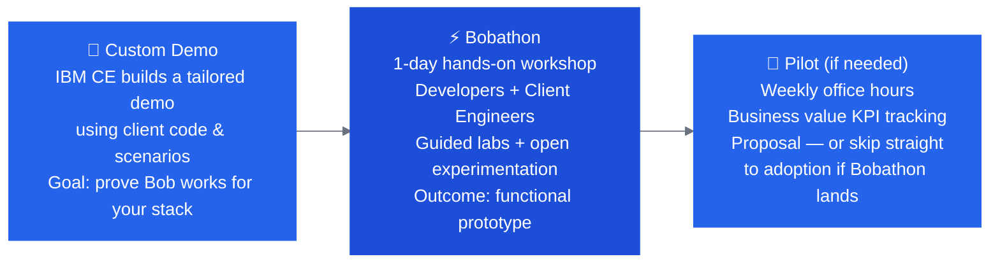
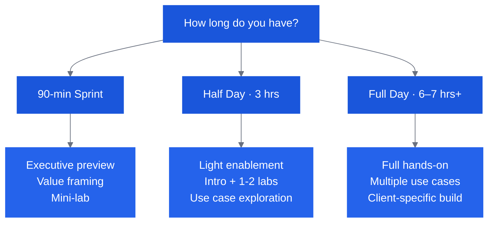

# IBM Bob — OpenSlava Lab Guide

**Hands-on lab guide for the IBM Bob Bobathon at OpenSlava.**
Three tracks — Beginner, Intermediate, Expert — each self-contained and runnable in ~90 minutes.

→ **[Jump straight to the OpenSlava tracks](labs/index.md)**

!!! note "IBM-internal links"
    Some links in this guide point to internal IBM resources (GitHub Enterprise, Confluence, Mural boards) that require IBM SSO. These are marked or will return a login page if you are not an IBMer. All lab code and the three OpenSlava track guides are fully public.

---

## What is a Bobathon?

A **Bobathon** (also called a Bob-a-thon or Bob Bootcamp) is a structured, hands-on workshop where client developers and IBM Client Engineers work together — using IBM Bob — to tackle real engineering problems on the client's actual technology stack.

It is **not** a product demo. It is a co-creation experience that produces working artifacts, builds developer confidence, and creates the momentum needed to move toward a sustained pilot.

---

## Who This Guide Is For

- **Client Engineers (CEs)** running pre-sales engagements — Bobathons are the primary CE activation motion
- **Forward Deployed Engineers (FDEs)** embedded in client teams — post-sale activation and scaled pilots
- **Client Value Engineers (CVEs)** driving SaaS adoption — Bobathons accelerate value realization on focus products
- **CE team leads** building repeatable bobathon practices

---

## How to Use This Guide

Follow the phases in order for a first engagement. Return to specific sections as needed.

| Phase | What You'll Do |
|---|---|
| [**Pitch & Discovery**](pitch/index.md) | Build the business case, identify the right contacts, understand Bob's value |
| [**Discovery & Scoping**](discovery/index.md) | Uncover client pain points, prioritize use cases, confirm tech stack |
| [**Planning & Prep**](planning/index.md) | Build the agenda, prepare the environment, set up labs and logistics |
| [**Use Cases & Labs**](labs/index.md) | Select and customize labs for Java, IBM i, Z, SDLC, and more |
| [**Delivery**](delivery/index.md) | Run the day-of event with confidence |
| [**Follow-Up**](followup/index.md) | Transition to a pilot, track KPIs, close the loop |

---

## The Bobathon in 60 Seconds

!!! info "Key facts for a first conversation"
    - **Duration:** Half-day (3–4 hrs) to full day (6–7 hrs or longer for complex engagements)
    - **Audience:** Client developers + architects, ideally 4–15 people
    - **Format:** Guided labs on the client's own code or IBM-provided sample applications
    - **Cost to client:** No charge — CE engagement model
    - **Lead time:** Minimum 1 week (standard); 3+ weeks if using client code or custom labs
    - **Outcome:** Working prototype, documented artifacts, clear pilot proposal

---

## Formats at a Glance

---

## Premium Package Tracks

IBM Bob has **Premium Packages** for specific platforms that unlock specialized modes and deeper capabilities. Three tracks warrant particular attention:

| Track | Premium Package | Key Differentiator |
|---|---|---|
| [IBM i (PPi)](labs/ibm-i.md) | ✅ Available (PPi) | [Flight400 Lab](https://github.com/bmarolleau/flight400-demo) · Direct QSYS connection, RPG/COBOL modernization, DDS→SQL, 5250 to React |
| [Java Modernization](labs/java.md) | ✅ Available | WebSphere → Liberty, Java 8 → 21, Spring migrations |
| [IBM Z](labs/ibm-z.md) | ✅ Available (pp4z) | COBOL/JCL/PL/I, GenApp, impact analysis, refactoring |

---

!!! tip "Use Bob to build your Bobathon"
    The [CE Bob Marketplace](https://ibm.biz/ce-bob-marketplace) includes a **Bobathon Builder Mode** and supporting skills that guide you through the entire preparation process — from client discovery to lab customization to agenda generation. See [Building with Bob](planning/build-with-bob.md).
