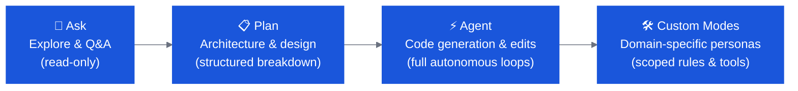

# IBM Bob — OpenSlava Bobathon

Welcome to the **IBM Bob Hands-On Workshop** at OpenSlava! This is your complete guide for the 90-minute session — choose a track, follow the step-by-step instructions, and build real applications with IBM Bob.

---

## Choose Your Track

<div class="grid cards" markdown>

-   :material-numeric-1-circle:{ .lg .middle } __[🟢 Beginner](labs/openslava-beginner.md)__

    ---

    **~70 min · 3 labs · No prior Bob experience needed**

    Build a confetti welcome app, add layover support to a full-stack travel app, then wire up date pickers and a mock AI booking agent — touching **Ask**, **Plan**, and **Agent** modes throughout.

    [:octicons-arrow-right-24: Start Beginner Track](labs/openslava-beginner.md)

-   :material-numeric-2-circle:{ .lg .middle } __[🟡 Intermediate](labs/openslava-intermediate.md)__

    ---

    **~70 min · 2 labs · Basic Bob familiarity assumed**

    Drive a full **Issue → Branch → Code → PR** loop with GitHub MCP, then author and commit version-controlled team rules that Bob applies automatically on every interaction.

    [:octicons-arrow-right-24: Start Intermediate Track](labs/openslava-intermediate.md)

-   :material-numeric-3-circle:{ .lg .middle } __[🔴 Expert](labs/openslava-expert.md)__

    ---

    **~90 min · 4 labs · For power users and architects**

    Discover a banking-industry codebase, build a React UI, run a security audit, author fintech compliance rules, create a custom scoped mode, and automate the full SDLC with GitHub MCP.

    [:octicons-arrow-right-24: Start Expert Track](labs/openslava-expert.md)

</div>

---

## Bob Modes at a Glance



---

## Prerequisites & Setup

### 1 — Get an IBMid

IBM Bob requires an IBMid. **IBMid is free** — create one at [ibm.com/account/reg](https://www.ibm.com/account/reg/us-en/signup?formid=urx-19776) (takes ~2 minutes). If you already have one, skip this step.

### 2 — Install IBM Bob

IBM Bob is a **standalone IDE** — not a VS Code extension. Download from [bob.ibm.com/download](https://bob.ibm.com/download) and sign in with your IBMid.

=== "IBM Bob IDE (recommended)"
    Download the installer for your OS from **[bob.ibm.com/download](https://bob.ibm.com/download)**:

    | OS | Installer |
    |---|---|
    | macOS (Apple Silicon) | `.pkg` — mac-ARM |
    | macOS (Intel) | `.pkg` — mac-intel |
    | Windows | `.exe` |
    | Linux (Debian/Ubuntu) | `.deb` |
    | Linux (Red Hat/Fedora) | `.rpm` |

    Run the installer, follow the wizard, then sign in with your **IBMid** on first launch.

=== "Bob Shell (terminal)"
    Prefer the terminal? Install Bob Shell instead:

    **macOS / Linux**
    ```bash
    curl -fsSL https://bob.ibm.com/download/bobshell.sh | bash
    ```
    **Windows (PowerShell)**
    ```powershell
    powershell -ep Bypass 'irm -Uri "https://bob.ibm.com/download/bobshell.ps1" | iex'
    ```
    Authenticate at `bob.ibm.com/login` when prompted.

### 3 — Other prerequisites

- **Node.js 20 LTS** and **Python 3.11+** installed
- **Git** configured with `user.name` and `user.email`
- **Galaxium Travels** cloned: `git clone https://github.com/IBM/galaxium-travels` *(Beginner / Intermediate tracks)*

---

## Resources

| | Link |
|---|---|
| **IBM Bob** | [bob.ibm.com](https://bob.ibm.com) |
| **Documentation** | [ibm.biz/bob-doc](https://ibm.biz/bob-doc) |
| **Blog** | [bob.ibm.com/blog/getting-the-most-out-of-bob](https://bob.ibm.com/blog/getting-the-most-out-of-bob) |
| **IBMid sign-up** | [ibm.com/account/reg](https://www.ibm.com/account/reg/us-en/signup?formid=urx-19776) |
