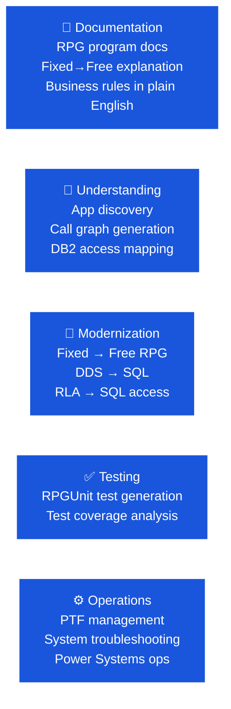

# IBM i Modernization Labs

IBM Bob's **Premium Package for i (PPi)** connects directly to IBM i source files in QSYS, unlocking AI-assisted modernization for RPG, COBOL, CL, DDS, and SQL programs without requiring a workspace sync.

🔗 **Flight400 Lab repo:** [flight400-demo](https://github.com/bmarolleau/flight400-demo) · [Lab Website](https://bmarolleau.github.io/flight400-demo/)

🔗 **SAMCO Lab repo:** [IBM-i-Application-Modernization-with-Bob](https://github.ibm.com/ClientEngineering/bob/tree/main/LABs/IBM-i-Application-Modernization-with-Bob)

🔗 **IBM i and Bob blog:** [https://bob.ibm.com/blog/ibm-i-and-bob/](https://bob.ibm.com/blog/ibm-i-and-bob/)

---

## IBM i is a Special Case

IBM i Bobathons differ from other tracks in two key ways:

1. **Environment:** Attendees need a connection to an IBM i LPAR. This is either provided by the client or set up by CE via TechZone.
2. **PPi differentiator:** PPi connects Bob **directly to native IBM i libraries** (QSYS) — no workspace sync required. This is the primary capability to demonstrate.

!!! tip "Blog post first"
    Share the [IBM i and Bob blog post](https://bob.ibm.com/blog/ibm-i-and-bob/) with clients before the event. It explains the value proposition in terms IBM i developers will recognize.

---

## Choosing the Sample Application

| | Flight400 | SAMCO |
|---|---|---|
| **Best for** | Quick demos, half-day workshops, first PPi contact | 3hr+ workshops, mixed-language codebases |
| **Languages** | RPG (OPM/ILE), DDS | RPG, COBOL, CL, C, C++, DDS, SQL |
| **Code location** | Native IBM i libraries (QSYS) — direct PPi connection, no extra scripting | Local workspace / Git — requires setup scripts to sync to source members |
| **Setup** | Restore via SQL script; for multi-user: `CPYLIB FROMLIB(FLGHT400) TOLIB(FLIGHT401)` per user | See build instructions in lab repo |
| **Repo** | [flight400-demo](https://github.com/bmarolleau/flight400-demo) | Lab repo |

!!! tip "Recommendation: Flight400 for first events"
    Flight400 lives natively in IBM i libraries. The primary PPi differentiator — connecting directly to IBM i source without workspace sync — is most visible with Flight400. It's the go-to for demos and half-day workshops.

---

## Lab Reference

### PPi Labs (Flight400 Application — Recommended)

🔗 **Lab Repository:** [github.com/bmarolleau/flight400-demo](https://github.com/bmarolleau/flight400-demo) · **Hosted Guide:** [bmarolleau.github.io/flight400-demo](https://bmarolleau.github.io/flight400-demo/)

| Exercise | Title | Description | Time |
|---|---|---|---|
| Part 0 | Environment Setup | Bob IDE install, PPi activation, IBM i extension pack, LPAR connection | 20 min |
| Exercise 1 | Code Explanation & Architecture Documentation | Generate architecture overview and ERD with Mermaid diagrams using IBM i Developer & Database modes | 30 min |
| Exercise 2 | Program-Level Explanation & Modernization | Explain RPG programs and convert fixed-format RPG to modern free-format | 30 min |
| Exercise 3 | Field Expansion: Add Total Flight Hours | Full end-to-end impact analysis and modification across DDS, display files, and RPG logic | 45 min |
| Exercise 4 | Database Optimization | Inspect database access, identify table scans, and create SQL indexes | 30 min |
| Exercise 5 | Ask Bob About Your System | Natural language queries against IBM i system status, active jobs, and spooled files | 20 min |
| Exercise 6 | RPGUnit Test Planning & Implementation | Generate test plans and RPGUnit test suites for RPG programs | 45 min |
| Exercise 7 | Generate React Carbon App from Green Screen | Transform legacy 5250 green screens into modern React Carbon applications | 45 min |

---

### PPi Labs (SAMCO Application)

| Lab | Title | Description | Time |
|---|---|---|---|
| Lab 100 | PPi Introduction | Overview of PPi capabilities; connect to SAMCO | 20 min |
| Lab 101 | Discover SAMCO | App understanding, program exploration, architecture overview | 30 min |
| Lab 102 | Fixed-to-Free Conversion | Modernize RPG fixed-format to free-format with Bob | 30 min |
| Lab 103 | DDS to SQL Workflow | Convert DDS data descriptions to SQL DDL | 45 min |
| Lab 104 | RLA to SQL | Modernize record-level access to SQL-based data access | 30 min |
| Lab 105 | Impact Analysis | Analyze ripple effects of a field change across the codebase | 30 min |
| Lab 106 | RPGUnit Testing | Generate and run RPGUnit tests with Bob | 45 min |

### PPi Ops / Sysadmin Labs

| Lab | Title | Description |
|---|---|---|
| Lab 200 | PPi for IBM i Ops / Sysadmin | Bob for IBM i troubleshooting and Power Systems operations |
| Lab 201 | IBM HMC | Power Systems hardware management with Bob |

### Additional Labs (Minimal IBM i Connection Required)

| Lab | Title | Description |
|---|---|---|
| Lab 01 | Additional Bob & IBM i Labs | Ansible/DevOps automation, IBM i MCP Server, Bob Shell |
| Lab 4 | IBM i MCP Mode | Connecting Bob to IBM i via MCP for direct system interaction |
| Lab 5 | Ansible PTF Management | Automating PTF management with Bob + Ansible |

---

## IBM i Use Case Examples



---

## Environment Setup

### IBM i LPAR
- Request from client or provision via TechZone (7+ days lead time)
- For shared LPARs with multiple attendees: copy the library for each user
  ```
  CPYLIB FROMLIB(FLGHT400) TOLIB(FLIGHT401)
  ```
  Repeat for each participant (FLIGHT402, FLIGHT403, etc.)

### VS Code IBM i Extension
- Install the IBM i Developer extension for VS Code
- Configure connection to the IBM i LPAR (host, port, credentials)
- Test connection from at least one attendee machine before the pre-event office hours

### PPi Activation
- Confirm the Premium Package for i is activated on attendee Bob accounts
- PPi provides the IBM i Developer mode in Bob that enables direct QSYS access

---

## Key Prerequisites Checklist

- [ ] IBM i LPAR provisioned and accessible for each attendee
- [ ] PPi activated on attendee Bob accounts
- [ ] VS Code IBM i extension installed and connected
- [ ] Sample application (Flight400 or SAMCO) restored on LPAR
- [ ] For shared LPARs: separate library copy per attendee
- [ ] IBM i developer or SME present on the day
- [ ] VS Code + Bob installed on attendee laptops
- [ ] Pre-event office hours completed with connection testing

---

## Suggested Agendas

### Half-Day (3 hours) — First PPi Contact

| Time | Activity |
|---|---|
| 0:00 – 0:30 | Intro, demo, environment verification |
| 0:30 – 0:50 | Lab 100 — PPi Introduction |
| 0:50 – 1:20 | Flight400 end-to-end demo / Lab 101 Discover |
| 1:20 – 2:15 | Lab 102 or 103 — Fixed→Free or DDS→SQL |
| 2:15 – 3:00 | Open experimentation + debrief + next steps |

### Full Day (6+ hours)

| Time | Activity |
|---|---|
| 09:00 – 09:30 | Intro & environment setup |
| 09:30 – 10:00 | Lab 100 + Flight400 demo |
| 10:00 – 10:30 | Lab 101 — Discover SAMCO |
| 10:30 – 11:00 | Lab 102 — Fixed→Free |
| 11:00 – 12:00 | Lab 103 — DDS→SQL |
| 12:00 – 13:00 | *Lunch* |
| 13:00 – 13:30 | Lab 104 — RLA→SQL |
| 13:30 – 14:30 | Lab 105 — Impact Analysis |
| 14:30 – 15:30 | Lab 106 — RPGUnit Testing |
| 15:30 – 16:00 | Debrief, Q&A, Next Steps |
