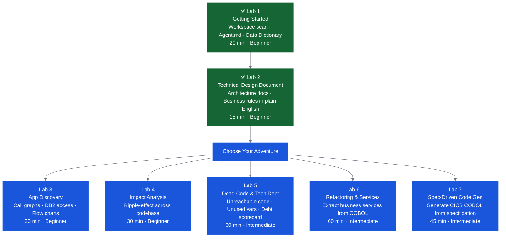

# IBM Z Modernization Labs

IBM Bob's **Premium Package for Z (pp4z)** unlocks specialized modes and deep COBOL/JCL/PL/I context that no generic AI coder can match. This page covers everything you need to plan and run a Z Bobathon.

🔗 **Lab repo:** [IBM-z-App-Modernization-with-Bob-Premium-For-z](https://github.ibm.com/ClientEngineering/bob/tree/main/LABs/IBM-z-App-Modernization-with-Bob-Premium-For-z)

---

## What Bob Can Do for Z Teams

| Capability | Description |
|---|---|
| **Application Understanding** | Generate technical design docs, architecture diagrams, call graphs, and plain-English explanations of any COBOL program |
| **Impact Analysis** | Identify every program affected by a proposed change; generate a risk-ranked rollout plan |
| **Business Rules Extraction** | Extract and document business rules from COBOL — readable by technical and non-technical stakeholders |
| **Refactoring & Service Extraction** | Break monolithic COBOL into reusable CICS LINK service programs |
| **Spec-Driven Code Generation** | Generate new CICS COBOL programs from plain-English specifications |
| **Dead Code & Technical Debt** | Surface unreachable paragraphs, unused variables, orphaned copybooks; rank programs by weighted debt scorecard |

---

## Key Scoping Questions for Z

Before confirming the Bobathon format, answer these:

=== "Code & Codebase"

    - [ ] Using GenApp (provided) or client's own COBOL workspace?
    - [ ] Do use cases require specific code (e.g., HLASM, PL/I)?
    - [ ] If client code: is source accessible in VS Code on the day?
    - [ ] How large is the codebase? *(local scanners have size limits)*
    - [ ] Is the code COBOL, PL/I, HLASM, or a mix?
    - [ ] Allow 3+ weeks if using client code — SME needed to curate content

=== "Scope & Goals"

    - [ ] What is the #1 modernization priority right now?
    - [ ] Are CICS and DB2 in scope for this event?
    - [ ] Is UI modernization a goal, or backend analysis only?

=== "Environment & Prerequisites"

    - [ ] Do attendees have admin rights to install Java 21 and Bob?
    - [ ] Can they create an IBM Cloud account, or is that blocked?
    - [ ] Any air-gapped or no-internet restrictions?
    - [ ] Java 21 pre-installed (any org-approved distribution)?

=== "Team & Constraints"

    - [ ] Is a COBOL expert or Z team member available on the day?
    - [ ] What is the COBOL experience level of attendees?
    - [ ] Are there AI tool usage policies or approval requirements?
    - [ ] Who is the executive sponsor and what are their KPIs?

---

## The GenApp Sample Application

**GenApp is the recommended default for Z Bobathons** — especially for first events.

| Attribute | Detail |
|---|---|
| **Why use it** | Pre-tested against all labs; predictable outputs; no setup surprises |
| **Stack** | Full CICS + DB2 + COBOL — covers every use case |
| **Program naming** | LG-prefix convention; clean and consistent |
| **Setup** | Provided as `.zip` — extract and open folder in Bob |

**Key GenApp Programs:**

| Program | Description |
|---|---|
| `LGDPDB01` | Policy Delete — DB2 operations |
| `LGAPDB01` | Policy Add — DB2 operations |
| `LGUPDB01` | Policy Update — DB2 operations |
| `LGIPDB01` | Policy Inquiry — DB2 operations |
| `LGACDB01` | Account — DB2 operations |
| `LGUCDB01` | Customer Update |
| `LGICUS01` | Customer Inquiry |
| `LGPOLVAL` | Policy Validation Service (extracted) |
| `LGERROR` | Error Logging Service |
| `LGRENPOL` | Renewal Policy (spec-driven example) |

---

## Lab Reference

Labs 1 and 2 are **always required**. Labs 3–7 are choose-your-own-adventure.

**Half-day:** Labs 1 + 2 + one adventure lab
**Full day:** Labs 1 + 2 + two or more adventure labs



---

## Planning Prerequisites

| Requirement | Detail |
|---|---|
| **Lead time — GenApp** | Minimum 1 week to provision pp4z instance. Request immediately after scoping. |
| **Lead time — Client code** | Minimum 3 weeks. SME must build and curate content. |
| **Java 21** | ⚠️ CRITICAL — must be installed before the event. Without it, IBM Z Open Editor will not function. Any Java 21 approved by client IT is acceptable. |
| **COBOL expert on the day** | Ensure a COBOL expert or Z team member is present to support attendees. |

### Java 21 Installation

=== "macOS — Homebrew"

    ```bash
    brew install --cask ibm-semeru-open-jdk21
    ```

    Then verify: `java -version` → should show `openjdk version "21.x.x"`

=== "macOS — Manual"

    1. Go to [IBM Semeru Runtimes Downloads](https://developer.ibm.com/languages/java/semeru-runtimes/downloads/)
    2. Select: Version 21, macOS, your chip (x64 for Intel, aarch64 for Apple Silicon)
    3. Download and run the `.pkg` installer
    4. Verify: `java -version`

=== "Windows"

    1. Go to [IBM Semeru Runtimes Downloads](https://developer.ibm.com/languages/java/semeru-runtimes/downloads/)
    2. Select: Version 21, Windows, x64, `.msi` installer
    3. Run installer — check **Add to PATH** and **Set JAVA_HOME variable**
    4. Open new PowerShell/Command Prompt: `java -version`

---

## Recommended 4-Hour Agenda

See the full template in [Agenda Templates](../planning/agenda-templates.md#template-4-z-4-hour-bobathon-standard).

---

## z/OS IT Ops Use Case

For Infrastructure & Operations teams, Bob also supports **Ansible playbook generation for z/OS**:

- Natural-language infrastructure request → validated Ansible playbook
- Automatically linted, stored in Git, deployed through CI/CD
- Eliminates ~8 hours of manual playbook authoring per playbook

This use case is covered in the [Other Labs](other.md) section and uses the **watsonx Assistant for Z** + **Ansible for z/OS** combination.
