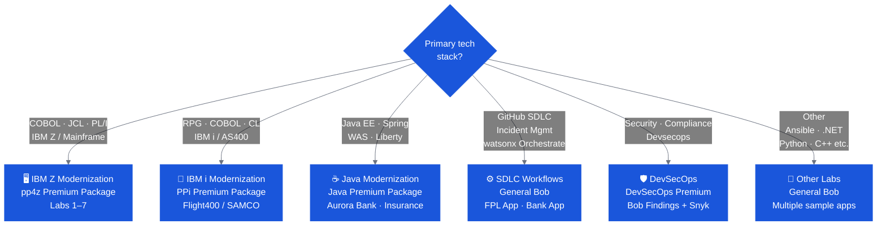

# Use Cases & Lab Menu

Select your labs based on the client's tech stack, modernization goal, and available time. Labs 1 and 2 of any track are always required — the rest are choose-your-own-adventure.

---

## OpenSlava 1.5h Hands-On Tracks

Three self-contained tracks designed for a 90-minute IBM Bob Bobathon at OpenSlava. Each track is independent — attendees pick the one that matches their experience level.

| Track | Audience | Labs | Total Time |
|---|---|---|---|
| [🟢 Beginner](openslava-beginner.md) | No prior Bob experience | B1 · B2 · B3 | ~70 min |
| [🟡 Intermediate](openslava-intermediate.md) | Basic Bob familiarity | I1 · I2 | ~70 min |
| [🔴 Expert](openslava-expert.md) | Experienced Bob users | E1 · E2 · E3 · E4 | ~90 min |

All labs use the **Galaxium Travels** demo app and the **GFM Bank** banking lab — both included in the workshop repo, no IBM SSO required.

---

## Track Selection

---

## Universal Lab Structure

Regardless of track, every Bobathon follows this structure:

| Phase | Content | Required? |
|---|---|---|
| **Foundation Labs** | Getting started, workspace scan, first outputs (e.g., documentation, TDD) | ✅ Always |
| **Adventure Labs** | Choose 1–3 based on goal: analysis, refactoring, testing, security, code gen | Choose relevant |
| **Client-Specific Lab** | Apply Bob to client's own code or a closely matched sample | When possible |

---

## Lab Menu at a Glance

### SDLC Workflows

| Lab | Title | Time |
|---|---|---|
| New Feature SDLC | Requirements → design → code → test → deploy | 60 min |
| Incident Management | Detect → diagnose → remediate → document | 60 min |
| GitHub SDLC with Bob | Full SDLC with GitHub MCP integration | 45 min |
| watsonx Orchestrate | Multi-agent architecture build | 90 min |

[→ Full SDLC Lab Guide](sdlc.md)

---

### IBM i (PPi Premium Package)

| Lab | Title | App | Time | Best For |
|---|---|---|---|---|
| Flight400 Lab Guide | [Flight400 Modernization](https://bmarolleau.github.io/flight400-demo/) (Exercises 1–7) | Flight400 | 2–3 hours | Recommended: full PPi workshop & demos |
| Lab 100 | PPi Introduction | SAMCO | 20 min | Multi-language workshops |
| Lab 101 | Discover SAMCO | SAMCO | 30 min | App understanding |
| Lab 102 | Fixed-to-Free Conversion | SAMCO | 30 min | RPG modernization |
| Lab 103 | DDS to SQL Workflow | SAMCO | 45 min | Schema modernization |
| Lab 104 | RLA to SQL | SAMCO | 30 min | Database access modernization |
| Lab 105 | Impact Analysis | SAMCO | 30 min | Change analysis |
| Lab 106 | RPGUnit Testing | SAMCO | 45 min | Test automation |

[→ Full IBM i Lab Guide](ibm-i.md)

---

### IBM Z (pp4z Premium Package)

| Lab | Title | Mode | Time | Difficulty | Required? |
|---|---|---|---|---|---|
| 1 | Getting Started | Z Architect | 20 min | Beginner | ✅ |
| 2 | Technical Design Document | Z Architect | 15 min | Beginner | ✅ |
| 3 | Application Discovery | Z Architect | 30 min | Beginner | Adventure |
| 4 | Impact Analysis | Z Architect | 30 min | Beginner | Adventure |
| 5 | Dead Code & Technical Debt | Z Architect | 60 min | Intermediate | Adventure |
| 6 | Refactoring & Service Extraction | Z Code | 60 min | Intermediate | Adventure |
| 7 | Spec-Driven Code Generation | Z Architect + Z Code | 45 min | Intermediate | Adventure |

[→ Full Z Lab Guide](ibm-z.md)

---

### Java Modernization

| Lab | Title | Sample App | Time |
|---|---|---|---|
| Modernization Assessment | Understand current state, upgrade path, risk mapping | Aurora Bank (Spring Boot 1.5) | 45 min |
| Java 8 → 21 Upgrade | Dependency analysis, migration, test validation | Aurora Bank | 60 min |
| WebSphere → Liberty | WAS config extraction, Liberty migration | Insurance (WAS Java EE) | 60 min |
| javax → jakarta Migration | Namespace migration at scale | Aurora Bank / Insurance | 30 min |
| Security Remediation | Bob Findings + CVE remediation | Any Java app | 30 min |

[→ Full Java Lab Guide](java.md)

---

### Other Available Labs

| Lab | Description |
|---|---|
| DevSecOps with Bob | Security checks, policy enforcement, compliance evidence |
| Ansible + Terraform | Infrastructure as code generation and deployment |
| IBM AIX / PowerVM | AIX administration and automation |
| OpenShift with Bob | Container deployment and management |
| IBM Maximo Script Modernization | EAM script modernization |
| IBM MQ Operations | MQ troubleshooting and automation |
| ABAP to Java | ABAP modernization path |
| Automotive (C++) | C++ modernization |
| Manufacturing (.NET) | .NET application modernization |

[→ Other Labs Overview](other.md)

---

## CE Bob Marketplace

The Marketplace has 300+ assets including lab collections for common engagement types:

🔗 [CE Bob Marketplace](https://ibm.biz/ce-bob-marketplace)

🔗 [APAC Lab Catalog](https://bob-lab-app.29szhis02s11.au-syd.codeengine.appdomain.cloud/)

[→ Marketplace Guide](marketplace.md)

---

## Lab Selection Tips

!!! tip "For first-time events"
    Pick labs that show **fast, visible value** — documentation generation and application understanding are the best openers. Attendees are often surprised by how quickly Bob produces useful output, and this builds confidence for deeper labs.

!!! warning "Avoid over-programming"
    A common mistake is planning too many labs. Build in buffer — clients run 2–5x slower than IBM practitioners. It's better to go deep on 2 labs than to rush through 5.

!!! tip "The baking show principle"
    For every lab, have a **final endpoint snapshot** ready. If time runs out or Bob has a bad moment, you can skip to the completed state and show the expected outcome. Don't let a technical hiccup derail the narrative.
