# Java Modernization Labs

Java Modernization is one of the highest-demand Bobathon tracks — most enterprises have a backlog of aging Java EE, Spring Boot 1.x, or WebSphere applications that developers avoid touching. Bob provides the assessment, migration, and validation capabilities to make these projects tractable.

🔗 **Banking lab (Spring Boot 1.5):** [Banking Industry Lab](https://github.ibm.com/ClientEngineering/bob/tree/main/LABs/Banking%20Industry%20(Java%20Modernization%20-%20Spring%20Boot%201.5))

🔗 **Insurance lab (WebSphere Java EE):** [Insurance Industry Lab](https://github.ibm.com/ClientEngineering/bob/tree/main/LABs/Insurance%20Industry%20(Java%20Modernization%20-%20WebSphere%20Java%20EE))

🔗 **Java Modernization Accelerator (Americas):** [https://github.ibm.com/AmericasTopTeam/java-modernization](https://github.ibm.com/AmericasTopTeam/java-modernization)

---

## What Bob Can Do for Java Teams

```mermaid
%%{init: {'theme': 'base', 'themeVariables': {'primaryColor': '#1a56db', 'primaryTextColor': '#ffffff', 'primaryBorderColor': '#1a56db', 'lineColor': '#6b7280', 'mainBkg': '#1a56db', 'nodeBorder': '#1a56db', 'clusterBkg': '#1e3a5f', 'titleColor': '#ffffff', 'edgeLabelBackground': 'transparent'}}}%%
flowchart LR
    U["🔍 Understand\nMap hidden logic\nDependency analysis\nArchitecture docs"] --> D["📄 Document\nGenerate architecture docs\nDiagrams · Business rules"] --> P["📋 Plan\nPhased migration path\nRisk assessment\nUpgrade roadmap"] --> R["🔧 Refactor\nCoordinate multi-file changes\njavax→jakarta migration\nWAS→Liberty conversion"] --> V["✅ Validate\nRun tests · Fix issues\nTest generation\nCI/CD integration"] --> G["🛡️ Govern\nCapture reviewable evidence\nCompliance docs\nSecurity scanning"]

    class U node
    class D node
    class P node
    class R node
    class V node
    class G node
    classDef node fill:#1a56db,color:#fff,stroke:#1a56db
    classDef secondary fill:#2563eb,color:#fff,stroke:#2563eb
    classDef highlight fill:#1d4ed8,color:#fff,stroke:#1d4ed8,stroke-width:3px
    classDef success fill:#166534,color:#fff,stroke:#166534
    classDef warning fill:#92400e,color:#fff,stroke:#92400e
    classDef decision fill:#1e40af,color:#fff,stroke:#1e40af
```

---

## Sample Applications

### Aurora Bank — Spring Boot 1.5 → 3.x

A small core-banking REST API (customers, accounts, double-entry ledger, transfers) built the way a 2016-era enterprise app looks. Used for:

- Honest upgrade assessment: Java 8 → 21, Spring Boot 1.5 → 3.x
- `javax.*` → `jakarta.*` namespace migration
- Oracle → PostgreSQL migration
- Includes IDE and CLI parts

### Insurance Industry — WebSphere Java EE

A WebSphere-based Java EE application. Used for:

- WAS → Liberty migration
- Java EE → Jakarta EE conversion
- Application configuration extraction and modernization

### Telecom Industry — Spring 4 XML and CXF SOAP

- SOAP → REST refactoring
- Spring XML configuration modernization
- Legacy WS* web service migration

---

## The Bobathon Formula for Java

*Example using Pharmacy Manager application:*

| Step | Example |
|---|---|
| **Current State** | Traditional WAS + Java 8 + Struts UI |
| **Target State** | Liberty + Java 21 + Angular |
| **Use Case 1** | Documenting code — generate a technical design document |
| **Use Case 2** | Interrogating code — understand downstream impact of input changes |
| **Use Case 3** | Improving testing — generate test cases from existing code or requirements |
| **Use Case 4** | Converting code — refactor to modern patterns |
| **Use Case 5** | Remediating vulnerabilities — fix detected security issues |

---

## Lab Structure

Each Java Modernization lab includes:

- **Starting snapshot** — known-good state to begin from
- **Lab guide** — step-by-step instructions with Bob prompts
- **Final endpoint snapshot** — completed state for the "baking show" fallback
- **Video** — walkthrough recording for async reference

### Suggested Lab Sequence

| # | Lab | Time | Goal |
|---|---|---|---|
| 1 | **Application Understanding** — scan codebase, generate architecture doc | 30 min | Immediate visible value; great opener |
| 2 | **Dependency & Upgrade Assessment** — what needs to change and why | 30 min | Maps the migration path |
| 3 | **javax → jakarta Migration** — automated namespace updates | 30 min | Tangible code transformation |
| 4 | **Test Generation** — generate unit tests for key classes | 30 min | Shows Bob's testing capability |
| 5 | **Security Remediation** — Bob Findings + CVE fix | 30 min | Shows Bob Findings and security value |

!!! tip "Choose 2–3 for a half-day"
    Labs 1 + 2 always. Then pick one of 3, 4, or 5 based on the client's primary pain.

---

## Key Prerequisites

- [ ] VS Code installed on attendee machines
- [ ] Java 21 JDK installed (needed for target state validation)
- [ ] Sample repo cloned and builds successfully
- [ ] IBM Application Modernization Accelerator access confirmed (if using)
- [ ] Bob Premium (Java) activated on attendee accounts

---

## Premium Package for Java

IBM Bob's Java Premium Package includes:
- **Java Modernization mode** — specialized prompts and workflows for Java upgrade scenarios
- **WebSphere → Liberty migration knowledge** — embedded patterns for common WAS configurations
- **Dependency alignment** — understanding of common Java EE → Jakarta EE compatibility issues
- **Multi-file coordination** — manages the cascade of changes a major Java upgrade requires

---

## Common Client Pain Points → Java Lab Mapping

| Client says... | Best lab(s) |
|---|---|
| "We have hundreds of old Java apps no one wants to touch" | Lab 1 (Understanding) + Lab 2 (Assessment) |
| "We need to move off WebSphere" | Lab 2 (Assessment) + javax→jakarta |
| "Our test coverage is terrible" | Lab 4 (Test Generation) |
| "We keep finding security issues in production" | Lab 5 (Security Remediation) |
| "We don't know what half this code does" | Lab 1 (Understanding) — always a strong opener |
