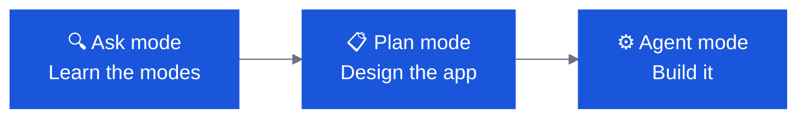

# OpenSlava — Beginner Track

Three labs · ~70 minutes total · No prior Bob experience needed

---

## Track Overview

| # | Lab | Time | Goal |
|---|---|---|---|
| B1 | **Explore Modes & Build the OpenSlava 2026 Welcome App** | 25 min | Learn the three Bob modes by building a confetti welcome page |
| B2 | **Connect & Expand Galaxium Travels: Flights with Layovers** | 25 min | Add a real feature to a full-stack app using Ask → Plan → Agent |
| B3 | **Date Picker, Price Ranker & Booking Agent** | 20 min | Three quick enhancements showing Bob handling UI, logic, and mock AI |

!!! tip "How to use this guide"
    Each lab builds on the previous one. Complete them in order. Every prompt block is copy-pasteable — click the copy icon on the top-right of any code block.

---

## Prerequisites

- [ ] VS Code installed
- [ ] IBM Bob extension installed and signed in
- [ ] Node.js 20 LTS installed
- [ ] Git installed
- [ ] 10 minutes before the session: clone the Galaxium repo
      `git clone https://github.com/IBM/galaxium-travels`

---

## Lab B1 — Explore Modes & Build the OpenSlava 2026 Welcome App

**25 minutes** · No code experience needed

### What you will learn

The three Bob modes — **Ask**, **Plan**, and **Agent** — each have a distinct role. This lab makes the difference tangible by using all three to build a single small app.



### Step 1 — Ask mode: understand the modes

1. Open VS Code on an **empty folder**
2. Open the Bob sidebar and select **Ask** mode
3. Send this prompt:

```
What are the three built-in Bob modes, what tools does each one permit,
and when should I use each?
```

**Observe:** Bob gives a clear answer but cannot create files or run commands.
Ask mode is read-only by design — perfect for questions and exploration.

!!! info "Ask mode = read-only"
    Ask mode has no `edit` or `command` tool groups. Bob can see your code but cannot touch it.

### Step 2 — Plan mode: design the app

1. Switch to **Plan** mode in the sidebar
2. Send this prompt:

```
Plan a React + Vite app called "OpenSlava 2026 Welcome".
It should show a full-screen welcome page with:
- Background colour IBM Bob blue (#0f62fe)
- White text: "Welcome to OpenSlava 2026"
- Subtitle: "Powered by IBM Bob"
- A confetti burst when the page loads

The confetti must use only CSS keyframe animations and vanilla JS — no npm packages.
Produce a component list, the CSS animation approach, and a file layout.
```

**Observe:** Bob produces a detailed plan — component names, CSS strategy, file tree — but writes nothing to disk. Plan mode can design but not implement.

!!! info "Plan mode = design without side-effects"
    Plan mode can read and propose edits, but does not execute commands. Great for pair-designing before committing to an implementation.

### Step 3 — Agent mode: implement

1. Switch to **Agent** mode
2. Send this prompt:

```
Implement the plan you just designed.
Scaffold a Vite + React app, create a WelcomeScreen component,
apply the IBM Bob blue colour scheme, and implement the confetti
using CSS keyframe animations on randomly positioned <span> elements
created by a small vanilla JS helper (no npm packages).
```

**Observe:**

- Bob runs `npm create vite`, installs dependencies
- Creates `src/WelcomeScreen.tsx` with the welcome layout
- Creates `src/confetti.ts` — generates ~40 `<span>` elements with random colours, positions, rotation, and staggered CSS animation delays
- Adds confetti CSS to `src/index.css`

### Step 4 — Run it

```bash
npm run dev
```

Open `http://localhost:5173` — confetti should burst on load.

!!! tip "Didn't get confetti?"
    Ask Bob in Agent mode: `"The confetti isn't appearing — check confetti.ts and the CSS animation names match."`

### Step 5 — Reflection

Switch back to **Ask** mode and send:

```
What would have happened if I had tried to run npm install
in Ask or Plan mode?
```

---

## Lab B2 — Connect & Expand Galaxium Travels: Flights with Layovers

**25 minutes** · Requires Lab B1 complete

### What you will learn

Galaxium Travels is the official IBM Bob demo app — a full-stack interplanetary booking system. You will run `/init` to give Bob deep context, then plan and implement a real feature across the full stack.

### Prerequisites

- [ ] Lab B1 complete (modes understood)
- [ ] Python 3.8+ installed
- [ ] Galaxium cloned: `git clone https://github.com/IBM/galaxium-travels`

### Step 1 — Clone and start

```bash
cd galaxium-travels
./start.sh
```

Open `http://localhost:5173` — you should see the Galaxium flight booking UI.

!!! note "Start.sh takes ~2 minutes"
    It installs Python deps, Node deps, and starts both servers. Frontend on `:5173`, backend on `:8001`.

### Step 2 — Run /init

1. Open the `galaxium-travels/` folder in VS Code
2. Switch to **Agent** mode
3. Type `/init` and send

**Observe:** Bob reads the entire codebase, then writes:

- `AGENTS.md` at the repo root — project overview, key constraints, file map
- `.bob/rules-agent/AGENTS-agent.md`, `.bob/rules-plan/AGENTS-plan.md`, `.bob/rules-ask/AGENTS-ask.md`

**Read `AGENTS.md` together.** Bob has discovered:

- The three services (frontend / backend / hold service)
- Custom Tailwind tokens (`space-dark`, `space-blue`, `cosmic-purple`, …)
- The FastMCP integration at `/mcp`
- The key constraint: **every new backend endpoint needs a REST handler AND a matching MCP tool**

### Step 3 — Plan the layovers feature

Switch to **Plan** mode and send:

```
Plan a "flights with layovers" feature for Galaxium Travels.

A layover is a stop between the origin and final destination,
with a planet name and layover duration in minutes.

The feature needs:
1. A LayoverStop type added to the TypeScript types and Python models
2. FlightRoute updated to hold a list of layover stops (can be empty)
3. Price calculation that adds 10% per layover stop
4. An updated route card UI showing layover stops inline

Follow the existing AGENTS.md conventions.
```

**Observe:** Bob produces a plan across all three layers without writing a single file.

### Step 4 — Implement

Switch to **Agent** mode and send:

```
Implement the layovers plan. Follow the AGENTS.md conventions:
- Add the REST endpoint AND a matching MCP tool for any new backend route
- Use snake_case in Python, PascalCase for TypeScript types
- Use the existing Tailwind space tokens for any new UI elements
```

**Observe Bob working across:**

- `booking_system_backend/models.py` — `LayoverStop` model
- `booking_system_backend/server.py` — updated route schema, MCP tool registration
- `booking_system_frontend/src/types/` — `LayoverStop` TypeScript type
- `booking_system_frontend/src/pages/Flights.tsx` — updated route card
- A new `LayoverBadge` component

**Restart the backend, refresh the browser** — multi-stop routes now appear.

### Step 5 — Verify

In **Ask** mode:

```
Does the new layover implementation follow the AGENTS.md constraint
that every backend route has both a REST handler and an MCP tool?
```

---

## Lab B3 — Date Picker, Price Ranker & Booking Agent

**20 minutes** · Requires Lab B2 complete · App must be running

### What you will learn

Three quick enhancements showing Bob handling UI input, sorting logic, and a mock AI agent pattern — all without leaving the Galaxium codebase.

### Enhancement 1 — Date picker (Agent mode)

```
Add a departure date picker to the Galaxium flight search form.
Use a native HTML <input type="date">.
When a date is selected, filter the search results client-side
to show only flights available on that day.
No external date library.
```

Verify the date input renders and the results list updates on selection.

### Enhancement 2 — Price sort toggle (Agent mode)

```
Add a sort toggle button to the Galaxium flight search results.
Clicking it cycles between "Price: Low to High" and "Price: High to Low".
Implement the sort entirely in component state — no external sort library.
```

Verify clicking the button re-orders the results.

### Enhancement 3 — Interplanetary Booking Agent (Plan → Agent)

First, switch to **Plan** mode:

```
Design a mock AI booking agent component called BookingAgent.
It takes a natural-language text input (e.g. "cheapest route to Europa")
and returns the top 3 matching routes from the existing flight data
using keyword matching and price/speed intent detection.
No real LLM call — pure client-side JavaScript logic.
```

Then switch to **Agent** mode:

```
Implement the BookingAgent component you just planned.
- A text input + submit button
- Parse the input for destination keywords and "cheapest"/"fastest" intent
- Filter and rank the flights array accordingly
- Display the top 3 matching routes as cards
```

**Test it:** type `"cheapest route to Europa"` — the top 3 cheapest Europa flights should appear.

!!! tip "Ask Bob to explain it"
    Switch to Ask mode: `"How does BookingAgent decide which flights match the intent 'cheapest'? Walk me through the logic."`

---

## What's next?

| If you want to go deeper… | Try |
|---|---|
| Team standards and SDLC automation | [Intermediate Track](openslava-intermediate.md) |
| Custom modes, MCP, and advanced Bob config | [Expert Track](openslava-expert.md) |
