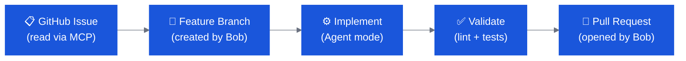
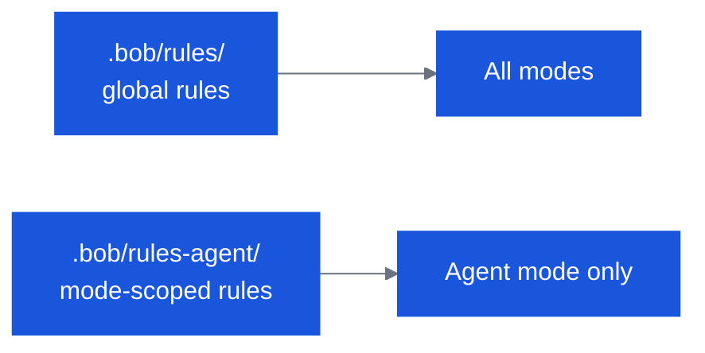

# OpenSlava — Intermediate Track

Two labs · ~70 minutes total · Assumes basic Bob familiarity

---

## Track Overview

| # | Lab | Time | Goal |
|---|---|---|---|
| I1 | **GitHub SDLC with Bob** | 40 min | Drive a full issue → branch → implement → PR loop with GitHub MCP |
| I2 | **Author, Modify & Commit Rules** | 30 min | Build version-controlled team standards that Bob applies automatically |

---

## Prerequisites

- [ ] **IBM Bob IDE** installed and signed in — download from [bob.ibm.com/download](https://bob.ibm.com/download) (standalone app, not a VS Code extension), or **Bob Shell** if you prefer a terminal (`curl -fsSL https://bob.ibm.com/download/bobshell.sh | bash`)
- [ ] Git configured (`git config --global user.name` and `user.email`)
- [ ] GitHub account with a personal access token (`repo` scope)
- [ ] GitHub MCP installed in Bob (see Lab I1 Step 1)

---

## Lab I1 — GitHub SDLC with Bob

**40 minutes**

### What you will learn

Bob can drive an entire software development lifecycle — reading a GitHub issue, creating a branch, implementing the change, running validation, and opening a PR — without you leaving your editor.



### Step 1 — Install GitHub MCP

1. Open the Bob sidebar → **Marketplace** icon
2. Search for **GitHub**
3. Click **Install**
4. Open Bob settings → MCP → GitHub → set `GITHUB_TOKEN` to your personal access token (`repo` scope)
5. Verify: no red error badge on the MCP server entry; Bob sidebar shows GitHub tools available

!!! tip "Create a token"
    GitHub → Settings → Developer settings → Personal access tokens → Tokens (classic) → New token → tick **repo** → Generate.

### Step 2 — Open the lab repo in IBM Bob

```bash
cd intermediate/labs/github-sdlc
```

Open this folder in **IBM Bob**. It contains a React finance app skeleton and supporting docs.

### Step 3 — Plan and build the finance dashboard

Switch to **Agent** mode. Start by having Bob understand the project and plan the build:

```
Review this repository and propose a build plan for a small React finance dashboard application.
The app should use Yahoo Finance data for:
- Euro Stoxx 50 (`^STOXX50E`), DAX (`^GDAXI`), Nikkei 225 (`^N225`),
  Dow Jones Industrial Average (`^DJI`), and MSCI World (`URTH`).
The dashboard should provide views for current day, last 7 days, and last quarter.
Explain the recommended project structure, data-fetching approach, UI sections, and testing strategy.
```

Once Bob has responded, scaffold the application:

```
Create a React application structure for this repository inside a directory named "finance-app".
Include a dashboard page, reusable chart card components, a finance data service layer,
and a clean folder layout suitable for future enhancements.
```

**Observe:** Bob creates the `finance-app` directory with the full project structure.

### Step 4 — Integrate Yahoo Finance data

Start a **new chat** in Bob and send:

```
Implement a finance data layer for the following stock indices using Yahoo Finance data:
Euro Stoxx 50 (`^STOXX50E`), DAX (`^GDAXI`), Nikkei 225 (`^N225`),
Dow Jones Industrial Average (`^DJI`), and MSCI World (`URTH`).
Normalize the returned data so the UI can display quote summaries,
short-term history, and quarterly trend views.
Keep the code easy to extend if more indices need to be added later.
```

In the same chat, build the dashboard views:

```
Build 2 to 3 dashboard views for the finance application:
- current day market summary
- last 7 days trend comparison
- last quarter comparison view

Include all five stock indices. Use charts and summary cards. Keep the UI simple and demo-friendly.
```

Run the app locally to verify:

```bash
cd finance-app
npm install
npm start
```

### Step 5 — Add validation and tests

Start a **new chat** in Bob and send:

```
Add appropriate validation for the finance dashboard project.
Include unit tests for the data formatting and normalization utilities,
and integration tests for at least one dashboard view rendered with mocked API data.
Use MSW to mock the finance API responses in tests.
Provide a single command that runs lint, type-check, tests, and build together,
and summarize what a successful run looks like.
```

Run the validation suite:

```bash
cd finance-app
npm run validate
```

A successful run completes without errors — lint, type-check, tests, and build all pass.

### Step 6 — Push to GitHub

1. Go to [https://github.com/new](https://github.com/new) and create a new repo named `finance-app` (no README, no .gitignore)
2. Copy the GitHub Actions CI config into your project:

```bash
# from the github-sdlc lab root
cp -r .github finance-app/.github
```

3. Initialize git and push:

```bash
cd finance-app
git init
git add .
git commit -m "Initial commit: finance dashboard"
git remote add origin https://github.com/YOUR_USERNAME/finance-app.git
git branch -M main
git push -u origin main
```

4. On GitHub, go to **Settings → General** and confirm **Issues** is enabled
5. Create a feature branch:

```bash
git checkout -b feature/user-selected-chart
git push -u origin feature/user-selected-chart
```

### Step 7 — Create a GitHub issue

On GitHub, open **Issues → New issue**:

- **Title:** `Add a graph for a user-selected index`
- **Body:** `Users should be able to type any stock ticker symbol and see a new chart for that symbol alongside the existing dashboards. Include loading and error states. Existing dashboard views must not be affected.`

Note the issue number (e.g. `#1`).

### Step 8 — Issue-to-PR loop

Open a **new chat** in Bob (**Agent** mode) and send — replace `#1` with your actual issue number:

```
Fetch and analyze GitHub issue #1 from this repository.
Explain the requested feature, identify which files need to change,
and propose an implementation plan.
```

In the same chat, implement:

```
Implement the feature described in the GitHub issue.
Add a user input for a stock ticker symbol that fetches and displays a new chart
for that symbol alongside the existing dashboards.
Reuse the existing data service layer, keep the UX simple,
and preserve all existing dashboard views.
```

Validate:

```
Run the full validation suite. Summarize what passed, what failed,
and whether the branch is ready to push to GitHub.
```

Start a **new chat** in Bob, then commit and push:

```
Review the changes made to implement the user-selected index chart feature in finance-app/.
Summarize what was added, fix any obvious problems, commit with a meaningful message,
and push to the feature/user-selected-chart branch. Do not yet create a pull request.
```

### Step 9 — Create the pull request

In the same chat, type this command directly:

```
/create-pr
```

Bob will display a workflow dialog. Click **"Start workflow"**, leave the pre-filled **Repository** and **Base Branch** values as-is, then click **"Generate PR Description"**.

**Observe:** Bob reads the git diff, detects the linked issue, fills in the PR template, and creates the pull request automatically.

!!! tip "Check the PR on GitHub"
    Visit the **Pull requests** tab on your repo to confirm the PR exists and references the issue number.

### Reflection

Switch to **Ask** mode:

```
In the SDLC loop we just ran, which steps required a human decision
and which were fully automated by Bob?
What are the risks of fully automating the PR step?
```

---

## Lab I2 — Author, Modify & Commit Rules

**30 minutes** · Requires Lab I1 complete (git configured)

### What you will learn

Rules are plain Markdown files that Bob reads before every conversation. They are version-controlled alongside your code and act as always-on team standards — no prompting required.



### Step 1 — Create global rules

Open `galaxium-travels/` in **IBM Bob**. In **Agent** mode:

```bash
mkdir -p .bob/rules
```

Create `.bob/rules/01-standards.md` with this content:

```markdown
Always include JSDoc comments for every public function.

Be very concise in responses.

After every Bob interaction, write a summary to the folder `internal-monologue/`.
Name each file with a timestamp prefix followed by a concise description.
Example: 2026-01-15_update-readme.md
```

### Step 2 — Test the rules

In **Agent** mode, ask Bob to add a utility function:

```
Add a utility function called formatPrice to
booking_system_frontend/src/services/api.ts
that takes a number and returns a string formatted as "€1,234.56".
```

**Observe:**

- Bob adds the function with a JSDoc comment automatically
- A new file appears in `internal-monologue/` describing what was changed

### Step 3 — Modify a rule

Edit `.bob/rules/01-standards.md` — change `internal-monologue/` to `bob-log/`:

```markdown
After every Bob interaction, write a summary to the folder `bob-log/`.
Name each file with a timestamp prefix followed by a concise description.
Example: 2026-01-15_update-readme.md
```

Ask Bob to make another small change:

```
Add a formatDate utility function to the same api.ts file
that formats an ISO date string as "DD MMM YYYY".
```

**Observe:** Bob writes to `bob-log/` now, not `internal-monologue/`.

### Step 4 — Add a mode-scoped rule

Create `.bob/rules-agent/02-agent-commits.md`:

```markdown
In Agent mode, after every file change create a git commit
with a descriptive message summarising what was changed and why.
```

Make a small code change in Agent mode (e.g. rename a variable). **Observe:** Bob commits automatically with a useful message.

!!! info "Mode-scoped rules"
    Files in `.bob/rules-agent/` are only injected when Bob is in Agent mode.
    Files in `.bob/rules/` are injected in every mode.
    Mode slug for built-in modes: `agent`, `plan`, `ask`.

### Step 5 — Commit the rules

```bash
git add .bob/ && git commit -m "Add team Bob rules for Galaxium Travels"
```

**Discussion:** Why do rules belong in version control alongside the code they govern?

- New team members get the standards automatically on first `git clone`
- Rule changes are reviewed through the normal PR process
- Rules are scoped to the project, not the developer's global Bob config

### Step 6 — Verify the rules persist

Close and reopen **IBM Bob**, then ask Bob something simple in Agent mode. Check that `bob-log/` gets a new entry — confirming the rules survive a session restart.

---

## What's next?

| If you want to go deeper… | Try |
|---|---|
| Custom modes, MCP, fintech audit, GitHub MCP E2E | [Expert Track](openslava-expert.md) |
