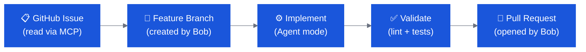
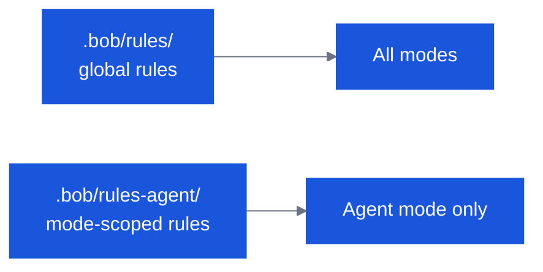

# OpenSlava — Intermediate Track

Two labs · ~70 minutes total · Assumes basic Bob familiarity

---

## Track Overview

| # | Lab | Time | Goal |
|---|---|---|---|
| I1 | **GitHub SDLC with Bob** | 40 min | Drive a full issue → branch → implement → PR loop with GitHub MCP |
| I2 | **Author, Modify & Commit Rules** | 30 min | Build version-controlled team standards that Bob applies automatically |

!!! warning "Mode names have changed"
    Older lab materials and videos may refer to **"Code mode"** and **"Chat mode"**.
    These names no longer exist. The current modes are:

    | Old name | Current name |
    |---|---|
    | Code mode | **Agent** mode |
    | Chat mode | **Ask** mode |
    | *(unchanged)* | **Plan** mode |

    Use the current names throughout this lab.

---

## Prerequisites

- [ ] VS Code installed with IBM Bob extension
- [ ] Git configured (`git config --global user.name` and `user.email`)
- [ ] GitHub account with a personal access token (`repo` scope)
- [ ] GitHub MCP installed in Bob (see Lab I1 Step 1)
- [ ] Galaxium Travels cloned and running (from Beginner Track, or re-clone fresh)

---

## Lab I1 — GitHub SDLC with Bob

**40 minutes**

### What you will learn

Bob can drive an entire software development lifecycle — reading a GitHub issue, creating a branch, implementing the change, running validation, and opening a PR — without you leaving your editor.



### Step 1 — Install GitHub MCP

1. Open the Bob sidebar → **Marketplace** icon
2. Search for **GitHub**
3. Click **Install**
4. Open Bob settings → MCP → GitHub → set `GITHUB_TOKEN` to your personal access token (`repo` scope)
5. Verify: no red error badge on the MCP server entry; Bob sidebar shows GitHub tools available

!!! tip "Create a token"
    GitHub → Settings → Developer settings → Personal access tokens → Tokens (classic) → New token → tick **repo** → Generate.

### Step 2 — Fork or use the GitHub-SDLC lab repo

The lab ships with a pre-built React finance dashboard you connect to GitHub.

**Option A — Use the lab repo directly (recommended):**

```bash
cd labs/github-sdlc
```

Open this folder in VS Code. It contains a React finance app and two workshop guides.

**Option B — Use your own GitHub repo:**
Push any existing project to GitHub and substitute that repo in the prompts below.

### Step 3 — Follow the GitHub-SDLC workshop

The lab ships as two structured workshop files:

| File | Content |
|---|---|
| `labs/github-sdlc/WORKSHOP-part1-BUILD.md` | Part 1: Bob builds and validates the finance dashboard locally |
| `labs/github-sdlc/WORKSHOP-part2-GITHUB-AUTOMATION.md` | Part 2: Bob connects to GitHub, reads an issue, implements, and opens a PR |

Work through both parts using **Agent** mode (formerly "Code mode").

!!! warning "Terminology in the workshop files"
    The workshop Markdown files were written before the mode rename. Wherever you see
    **"Code mode"** read it as **Agent mode**. Wherever you see **"Chat mode"** read it as **Ask mode**.

### Step 4 — Key checkpoints

Watch Bob do each of these automatically:

- [ ] Read the GitHub issue via the MCP `get_issue` tool
- [ ] Create a feature branch with `create_branch`
- [ ] Implement the feature in Agent mode
- [ ] Run `npm run lint` and `npm test` to validate
- [ ] Commit with a descriptive message
- [ ] Open a PR using `create_pull_request`, referencing the issue number

### Step 5 — Reflection

Switch to **Ask** mode:

```
In the SDLC loop we just ran, which steps required a human decision
and which were fully automated by Bob?
What are the risks of fully automating the PR step?
```

### Extension task

Create a second GitHub issue of your own design and run the complete loop unassisted:

```
Read the latest open issue in this repo, create a feature branch,
implement the change, validate it passes lint and tests, and open a PR.
```

---

## Lab I2 — Author, Modify & Commit Rules

**30 minutes** · Requires Lab I1 complete (git configured)

### What you will learn

Rules are plain Markdown files that Bob reads before every conversation. They are version-controlled alongside your code and act as always-on team standards — no prompting required.



### Step 1 — Create global rules

Open `galaxium-travels/` in VS Code. In **Agent** mode:

```bash
mkdir -p .bob/rules
```

Create `.bob/rules/01-standards.md` with this content:

```markdown
Always include JSDoc comments for every public function.

Be very concise in responses.

After every Bob interaction, write a summary to the folder `internal-monologue/`.
Name each file with a timestamp prefix followed by a concise description.
Example: 2026-01-15_update-readme.md
```

### Step 2 — Test the rules

In **Agent** mode, ask Bob to add a utility function:

```
Add a utility function called formatPrice to
booking_system_frontend/src/services/api.ts
that takes a number and returns a string formatted as "€1,234.56".
```

**Observe:**

- Bob adds the function with a JSDoc comment automatically
- A new file appears in `internal-monologue/` describing what was changed

### Step 3 — Modify a rule

Edit `.bob/rules/01-standards.md` — change `internal-monologue/` to `bob-log/`:

```markdown
After every Bob interaction, write a summary to the folder `bob-log/`.
Name each file with a timestamp prefix followed by a concise description.
Example: 2026-01-15_update-readme.md
```

Ask Bob to make another small change:

```
Add a formatDate utility function to the same api.ts file
that formats an ISO date string as "DD MMM YYYY".
```

**Observe:** Bob writes to `bob-log/` now, not `internal-monologue/`.

### Step 4 — Add a mode-scoped rule

Create `.bob/rules-agent/02-agent-commits.md`:

```markdown
In Agent mode, after every file change create a git commit
with a descriptive message summarising what was changed and why.
```

Make a small code change in Agent mode (e.g. rename a variable). **Observe:** Bob commits automatically with a useful message.

!!! info "Mode-scoped rules"
    Files in `.bob/rules-agent/` are only injected when Bob is in Agent mode.
    Files in `.bob/rules/` are injected in every mode.
    Mode slug for built-in modes: `agent`, `plan`, `ask`, `advanced`.

### Step 5 — Commit the rules

```bash
git add .bob/ && git commit -m "Add team Bob rules for Galaxium Travels"
```

**Discussion:** Why do rules belong in version control alongside the code they govern?

- New team members get the standards automatically on first `git clone`
- Rule changes are reviewed through the normal PR process
- Rules are scoped to the project, not the developer's global Bob config

### Step 6 — Verify the rules persist

Close and reopen VS Code, then ask Bob something simple in Agent mode. Check that `bob-log/` gets a new entry — confirming the rules survive a session restart.

---

## What's next?

| If you want to go deeper… | Try |
|---|---|
| Custom modes, MCP, fintech audit, GitHub MCP E2E | [Expert Track](openslava-expert.md) |
