# SDLC Workflow Labs

SDLC Workflow Bobathons demonstrate how Bob accelerates the **entire software development lifecycle** — not just code writing. These labs work with modern tech stacks and are well-suited for teams not on legacy platforms.

🔗 **Americas repo:** [bob-a-thon-americas](https://github.ibm.com/WW-CE/bob-a-thon-americas)

🔗 **GitHub SDLC lab:** [Github-SDLC](https://github.ibm.com/ClientEngineering/bob/tree/main/LABs/Github-SDLC)

---

## SDLC Track Options

### Track A: New Feature SDLC Workflow

Demonstrates the full lifecycle of feature development from ideation to deployment using Bob + external integrations.

**Key technologies:**
- Bob AI IDE
- Aha! Ideas (requirements / product management)
- Tavily AI (web research)
- MCP (Model Context Protocol for connecting external tools)

**Flow:**

```mermaid
%%{init: {'theme': 'base', 'themeVariables': {'primaryColor': '#1a56db', 'primaryTextColor': '#ffffff', 'primaryBorderColor': '#1a56db', 'lineColor': '#6b7280', 'mainBkg': '#1a56db', 'nodeBorder': '#1a56db', 'clusterBkg': '#1e3a5f', 'titleColor': '#ffffff', 'edgeLabelBackground': 'transparent'}}}%%
flowchart LR
    I["💡 Ideation\nAha! Ideas\nCapture feature requests"] --> R["🔍 Research\nTavily AI\nGather implementation info"] --> Im["⚙️ Implement\nBob IDE\nGenerate code from research"] --> T["✅ Test\nAuto-generate tests\nValidate against requirements"] --> D["🚀 Deploy\nCI/CD pipeline\nDocumentation"]

    class I node
    class R node
    class Im node
    class T node
    class D node
    classDef node fill:#1a56db,color:#fff,stroke:#1a56db
    classDef secondary fill:#2563eb,color:#fff,stroke:#2563eb
    classDef highlight fill:#1d4ed8,color:#fff,stroke:#1d4ed8,stroke-width:3px
    classDef success fill:#166534,color:#fff,stroke:#166534
    classDef warning fill:#92400e,color:#fff,stroke:#92400e
    classDef decision fill:#1e40af,color:#fff,stroke:#1e40af
```

**Sample application:** FPL (Fictional Power & Light) — an energy management system for monitoring electricity usage, billing history, and outage reporting.

---

### Track B: Incident Management & Resolution

A realistic incident management scenario using Bob to accelerate diagnosis, remediation, and documentation.

**Scenario:** A banking application experiences production degradation — users report 3–5 second page load times. Root cause: under-provisioned backend (single replica overloaded).

**Learning objectives:**
1. Understand application architecture and normal operation
2. Create and track incidents in ServiceNow
3. Use automated diagnostics to identify root causes
4. Apply infrastructure scaling with Terraform
5. Verify resolution with metrics
6. Document the complete incident lifecycle

**Key technologies:**
- Bob AI IDE
- ServiceNow (incident tracking via MCP)
- Terraform (infrastructure scaling)
- Kubernetes metrics and monitoring

---

### Track C: GitHub SDLC with Bob

Full software development lifecycle using GitHub as the integration hub via MCP.

**Covers:**
- Requirements analysis and issue creation in GitHub
- Code generation and PR automation
- Automated code review and quality gates
- Test generation and CI validation
- Deployment pipeline orchestration

🔗 [GitHub SDLC Lab](https://github.ibm.com/ClientEngineering/bob/tree/main/LABs/Github-SDLC)

---

### Track D: watsonx Orchestrate Multi-Agent

For clients looking to build agentic AI architectures, this lab demonstrates building a multi-agent system with Bob.

**Example scenario:** A multi-agent Benefits Advisor with specialized agents for formulary coverage, cost calculation, prior authorization, and pharmacy programs.

**What Bob helps build:**
- Upload documents to cloud via CLI
- Scripts to chunk, embed, and store documents in a Milvus vector database
- Extend a multi-agent architecture: create new agent, create knowledge base connection, update supervisor, import to orchestrator

---

## SDLC Lab Selection Guide

| Client Goal | Recommended Lab |
|---|---|
| Show Bob's full SDLC coverage end-to-end | Track A (New Feature SDLC) |
| Reduce MTTR / improve ops efficiency | Track B (Incident Management) |
| Integrate Bob with existing GitHub workflow | Track C (GitHub SDLC) |
| Build / extend AI agents and automation | Track D (watsonx Orchestrate) |
| General "what can Bob do for developers?" | Track A or Mix of A+B |

---

## Suggested Agenda (Half-Day SDLC)

| Time | Activity |
|---|---|
| 0:00 – 0:30 | Intro to Bob + SDLC demo |
| 0:30 – 1:00 | Environment setup + MCP integrations overview |
| 1:00 – 2:00 | Track A or B — guided hands-on lab |
| 2:00 – 2:45 | Open experimentation on client's own scenarios |
| 2:45 – 3:00 | Debrief + next steps |

---

## Prerequisites

- [ ] VS Code + Bob installed
- [ ] Git configured
- [ ] Sample repo accessible
- [ ] For Track B: access to ServiceNow sandbox (or mock) and Terraform CLI
- [ ] For Track D: IBM Cloud account + watsonx Orchestrate access
- [ ] For Track C: GitHub account + MCP server configured

---

!!! info "Coming Soon"
    Detailed lab guides for each SDLC track are being developed. In the meantime, refer to the [Americas repo](https://github.ibm.com/WW-CE/bob-a-thon-americas) and contact the Americas CE team for facilitation guidance.
