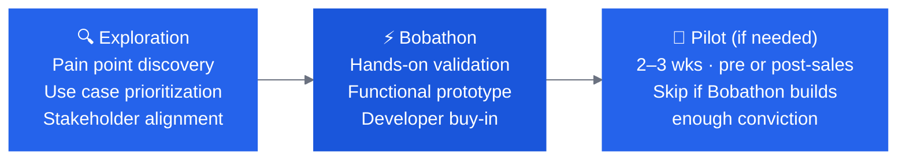

# Pitch & Discovery Overview

Before you can run a Bobathon, you need to earn the conversation. This section covers how to position the Bobathon, build the business case, and get the right people in the room.

---

## The Pitch in Context

A Bobathon is positioned as the **middle step** in the CE engagement model — not a standalone event. When pitching, anchor to this progression:

The pitch is not "would you like a workshop?" — it is "we've identified that your team has a real problem with [X]. Let us spend a day with your developers proving that Bob can solve it."

---

## What You Need Before Pitching

- [ ] A named opportunity or account team contact
- [ ] At least one identified developer pain point (documentation debt, modernization backlog, testing gaps, incident resolution time)
- [ ] A rough sense of the client's tech stack (Java, COBOL, RPG, Python, etc.)
- [ ] Awareness of any AI tool approval policies or procurement constraints

---

## Key Sections

- :material-currency-usd: **[Value Proposition](value-proposition.md)**

    IBM Bob's commercial model, productivity gains, and why it differentiates against competitors.

- :material-chat-processing: **[Pitch Conversation Guide](conversation-guide.md)**

    A structured talk track for introducing Bob and the Bobathon concept to client stakeholders. *First draft — evolve with your team.*

- :material-handshake: **[How to Engage CE](how-to-engage.md)**

    Step-by-step instructions for submitting an ISC/DSR request to engage Client Engineering.

---

## Common Objections & Responses

| Objection | Response |
|---|---|
| "We already have GitHub Copilot / Cursor" | Bob's enterprise controls, hybrid deployment, predictable flat-rate pricing, and Premium Packages for legacy platforms go where generic AI coders can't. |
| "We don't have time for a workshop" | A Bobathon can be a 90-min sprint or a focused 3-hour half-day. We flex to your calendar. |
| "Our code is sensitive / can't leave the network" | Bob supports air-gapped, on-prem, and hybrid deployment. We can run the Bobathon on client machines with client code. |
| "We're still evaluating AI tools" | That's exactly what the Bobathon is for — a low-risk, no-cost way to evaluate Bob against your actual workload, not a contrived demo. |
| "Do we need to buy anything?" | No. The CE engagement — including the Bobathon — is at no cost. Licensing conversations happen after value is proven. |

---

!!! quote "Customer voice"
    *"We achieved 100% refactored code. Everything I thought would be a problem, Bob solved. The old .NET SOAP service was completely refactored to modern REST API with clean architecture."*

    *"What would've taken me days to completely work out by myself, the tool I needed to continue intelligently automating workflows within AppSys is done in just a few minutes... This is what AI-assisted development should feel like."*
