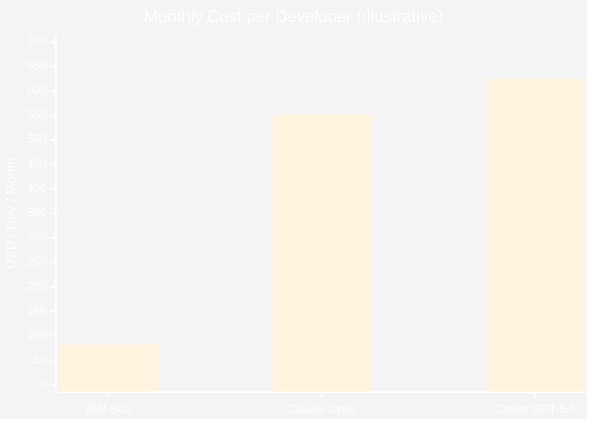

# Value Proposition

Use this page to build the commercial and technical business case for IBM Bob before and during a client pitch.

---

## The One-Sentence Value Statement

> **IBM Bob gives engineering teams the AI development capacity they need for large-scale modernization, while giving finance one clean forecasting model.**

---

## Commercial Comparison

IBM Bob's pricing model is intentionally simple: **$20/seat/month + $1.25 per million tokens**. No cache tiers, no separate input/output rates, no model selection complexity.

| Product | Cost / Developer / Month | Predictability |
|---|---|---|
| **IBM Bob** | **$82.50** *(at 50M tokens)* | ✅ High — 1 formula |
| Claude Opus | $550 | ⚠️ Medium |
| OpenAI Codex GPT-5.5 | $625 | ⚠️ Medium |

*Assumptions: 100 devs, 50M tokens/dev/month, 70% input / 30% output. No IBM cache savings assumed. Illustrative only — validate with current IBM pricing guidance.*

**At 100 developers:**

- IBM monthly team cost: **$8,250**
- vs. Claude: **$46,800/month savings**
- vs. Codex: **$54,300/month savings**

---

## What Bob Does That Generic AI Coders Don't

IBM Bob differentiates on five dimensions that matter in enterprise engagements:

### 1. Premium Packages for Legacy Platforms
Where scarce skills slow delivery — COBOL on Z, RPG on IBM i, Java EE modernization — Bob has **domain-specific modes, workflows, and knowledge** that generic AI coders lack entirely.

### 2. Modes & BobRules — Governed AI Behavior
Teams can define exactly how Bob operates: which tools it can use, what standards it must follow, what it cannot touch. This is enterprise-grade AI control, not an unbounded chatbot.

### 3. Extensible via MCP & Bob Marketplace
Bob connects to Jira, ServiceNow, GitHub, Terraform, Snyk, and 300+ assets in the CE Bob Marketplace — turning it into an end-to-end SDLC partner, not just a code autocomplete tool.

### 4. Hybrid Deployment
SaaS, air-gapped VM, or on-premises. Bob fits the client's operating model — including regulated and restricted environments.

### 5. Semantic Routing & Cost Visibility
Bob automatically selects the right model for each task, compresses context, and gives admins full usage visibility via Bobcoins and Bobalytics.

---

## Productivity Evidence

!!! note "Source: IBM's own Client Zero program"
    The following productivity gains are based on IBM's internal adoption of Bob across its own software development teams, products, and services.

- **Time savings:** Hours saved per developer per week on documentation, testing, code reviews, and boilerplate
- **Quality improvements:** Reduction in bugs caught late; improved code consistency across teams
- **Security:** Fewer vulnerabilities escaping to production with Bob Findings automated scanning
- **Onboarding:** New developers productive faster when Bob can explain unfamiliar codebases on demand

---

## SDLC Coverage

Bob assists across the **entire software development lifecycle** — not just code generation:

```mermaid
%%{init: {'theme': 'base', 'themeVariables': {'primaryColor': '#1a56db', 'primaryTextColor': '#ffffff', 'primaryBorderColor': '#1a56db', 'lineColor': '#6b7280', 'mainBkg': '#1a56db', 'nodeBorder': '#1a56db', 'clusterBkg': '#1e3a5f', 'titleColor': '#ffffff', 'edgeLabelBackground': 'transparent'}}}%%
flowchart LR
    P["📋 Plan\nJira · Aha! · Confluence"] --> D["</> Develop\nGitHub · GitLab · VS Code"] --> T["✅ Test\nSelenium · Playwright · Cypress"] --> S["🔒 Secure\nSnyk · Semgrep · Guardium"] --> Dep["⬆ Deploy\nTerraform · Jenkins · Kubernetes"] --> O["📊 Operate\nInstana · Datadog · PagerDuty"]

    class P node
    class D node
    class T node
    class S node
    class Dep node
    class O node
    classDef node fill:#1a56db,color:#fff,stroke:#1a56db
    classDef secondary fill:#2563eb,color:#fff,stroke:#2563eb
    classDef highlight fill:#1d4ed8,color:#fff,stroke:#1d4ed8,stroke-width:3px
    classDef success fill:#166534,color:#fff,stroke:#166534
    classDef warning fill:#92400e,color:#fff,stroke:#92400e
    classDef decision fill:#1e40af,color:#fff,stroke:#1e40af
```

---

## Useful Links for Building the Business Case

- [Bob ROI Calculator](https://ibm.box.com/s/eiwj5zdqayajgo4xmpt4w5jjv9da3n5o) — input client headcount and token estimates
- [Bob Sales Kit (Seismic)](https://ibm.seismic.com/Link/Content/DCg4cRfBQ6V7G8TW3ppJ6XT8qcM3) — customer decks, case studies, quotes
- [Bob FAQ (Seismic)](https://ibm.seismic.com/Link/Content/DC7Xj3qHDVMP3GTV3HfMD6PPQCWG)
- [CE Bob Workshop (Mural)](https://ibm.biz/bob_ce_workshop) — use case prioritization and business value exploration template
