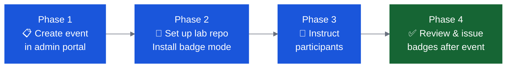

# Badging Setup

IBM Bob Bobathons can award **Credly digital badges** to participants who complete the session. Badges are issued via the CE Bob Badge Portal and a Bob extension installed in the lab repo.

🔗 **Badge portal:** [https://bob-badge-portal.ce.techzone.ibm.com/](https://bob-badge-portal.ce.techzone.ibm.com/) *(IBM w3id SSO)*

🔗 **Full guide:** [https://pages.github.ibm.com/WW-CE/bobathon-badging](https://pages.github.ibm.com/WW-CE/bobathon-badging)

---

## Overview

**Time estimate:** ~20 minutes before the event + ~5 minutes per participant at review time.

---

## Phase 1: Create an Event (Before Prep)

1. Sign into [https://bob-badge-portal.ce.techzone.ibm.com/](https://bob-badge-portal.ce.techzone.ibm.com/) with IBM w3id
2. Click **Create Event** and fill in:
    - Event name (human-readable)
    - Event slug (lowercase, numbers, underscores — participants type this)
    - Start and end dates
    - Owner emails (your IBM email)
    - Badges to award (e.g., ✅ IBM Bob Builder)
3. **Copy the API key immediately** — shown once on the post-creation screen (retrievable later via the portal)

---

## Phase 2: Set Up the Lab Repo (Before the Event)

1. Download the IBM Bob Badge Issuer `.vsix` from the [badging repo](https://github.ibm.com/WW-CE/bobathon-badging/tree/main/bob-badging-extension)
2. Install it in Bob: Extensions panel → `···` menu → **Install from VSIX…**
3. Open your lab repo in Bob, click the **🏅 Badge Issuer** icon
4. Click **Install** — enter the service URL and API key from Phase 1
5. Commit and push the generated `.bob/` files to the lab repo

After this, any participant who clones the repo gets the badge mode automatically.

---

## Phase 3: Instruct Participants (Day-of)

Tell participants at the start of the session:

> *"At the end of today, you can earn an IBM Bob badge. Make sure you have a [Credly account](https://www.credly.com) — use the email you want your badge sent to. At the end, switch to **🏅 Badge Issuer Lite** mode and tell Bob 'I'd like to earn a badge for my work today.' The event slug is: **[your-slug]**"*

**Participant checklist:**

- [ ] Lab repo cloned (`.bob/` folder present)
- [ ] IBM Bob extension installed
- [ ] Credly account created with known email address
- [ ] Event slug from organiser

---

## Phase 4: Review and Issue Badges (After Event)

1. Sign into the portal, expand your event accordion
2. Requests arrive with status **Review** — approve or reject each one
3. Use **Bulk approve** to approve multiple requests at once
4. Click **Issue N approved badges** → confirm → Credly emails participants

!!! danger "Send Badge Claim Notifications Within 24 Hours"
    Field data shows badge claim rates **drop sharply after 72 hours**. Always issue badges and distribute claim notification emails within **24 hours** post-event, including a direct Credly link and a clear **7–10 day claim deadline**.

---

## Add Badging to Your Planning Checklist

Add these to your [Pre-Event Checklist](checklist.md):

- [ ] Event created in badge portal (slug, dates, badges, owner email)
- [ ] API key and slug noted
- [ ] Badge Issuer extension installed in Bob
- [ ] Badge mode installed in lab repo and committed
- [ ] Participants told to create Credly accounts before the event
- [ ] Event slug included in attendee communications

---

## Troubleshooting

| Problem | Fix |
|---|---|
| Badge Issuer Lite mode not appearing | Restart Bob / open new conversation. Check `.bob/custom_modes.yaml` exists |
| "No active badges for this event" | Verify event slug matches exactly. Check event is active in portal |
| Participant gets 401 / "Invalid API key" | Check key in `.env.badge-issuer`. Retrieve from portal (eye icon) |
| Wrong Credly email used | Contact IBM badge team — they can reissue to correct address |
| Issue button fails | Check [status.credly.com](https://status.credly.com) and contact IBM badge team |
