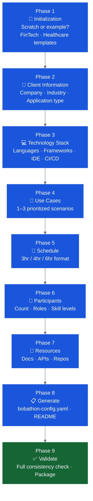

# Building Your Bobathon with Bob

IBM Bob is your preparation co-pilot as much as your delivery tool. There are **two equally valid approaches** to building Bobathon materials — choose based on how much structure you want.

---

## Two Approaches

=== "🤖 Bobathon Builder Mode"

    **Best for:** First-time builders, ensuring nothing is missed, consistent outputs across the team.

    The Bobathon Builder is a dedicated Bob mode with structured workflows and validation. It asks guided questions, enforces mandatory decisions, and produces a complete validated kit.

    - Guided Q&A — offers specific choices at every step
    - Mandatory checkpoints (code strategy, differentiators, validation)
    - Consistent output across CE practitioners
    - **Built-in validation enforced before packaging** — the Builder will not let you save without passing

    ➡️ [Jump to Builder Mode section](#option-1-bobathon-builder-mode)

=== "📝 Direct Bob + Spec Doc"

    **Best for:** Experienced practitioners, quick customizations, iterating on existing materials.

    Fill in a client context spec, then prompt Bob directly. You stay in control of what gets generated and when.

    - Faster for practitioners who know what they need
    - Works in any Bob mode (Agent mode is fine)
    - Iterate on specific outputs without running a full workflow
    - No workflow overhead for small customizations
    - **Validation is your responsibility** — use the [validation checklist](#validating-your-materials-required-for-both-approaches) before finalizing

    ➡️ [Jump to Direct Bob section](#option-2-direct-bob-with-a-spec-doc)

---

## Start Here: The Client Context Spec

!!! tip "Do this first — regardless of which approach you use"
    **Write a `client-spec.md` before generating anything.** This is the single most effective step — the more context Bob has upfront, the better everything it generates will be. It works for both the Builder Mode and direct prompting.

    📄 [Client Context Spec Template](client-spec.md) — copy, fill in what you know, save as `client-spec.md` in your working folder.

### What to Capture

| Category | What to Document |
|---|---|
| **Client basics** | Company name, industry, primary contact |
| **Technology stack** | Languages, frameworks, runtime, infrastructure, IDE, version control |
| **Application context** | What the application does, current state, target state |
| **Pain points** | Where developers spend the most time, what's slowing them down |
| **Use cases** | 1–3 prioritized scenarios with business impact |
| **Participants** | Count, roles, skill levels, domain experience (COBOL/RPG/Java) |
| **Constraints** | Install rights, network restrictions, AI policy, timeline |
| **Success criteria** | How the client will judge the Bobathon a success |

---

## Option 1: Bobathon Builder Mode

### Setup

1. Install from the [CE Bob Marketplace](https://ibm.biz/ce-bob-marketplace) — search **"Bobathon Builder"**, or clone directly:
   ```
   https://github.ibm.com/WW-CE/bob_bootcamp_builder
   ```
2. Fill in [Client Context Spec](client-spec.md) → save as `client-spec.md`
3. Open the `bob_bootcamp_builder/` folder in Bob
4. Switch to **🎓 Bobathon Builder** mode
5. Tell Bob:
   > *"I want to create a new Bobathon for a client. I've captured the context in `client-spec.md` — please read that file and run the `setup_new_bobathon` workflow."*

Bob reads your spec, skips questions it can already answer, and asks only about gaps — saving 15–20 minutes of intake time.

### Builder Workflows

The Builder has named workflows for each task. Trigger them explicitly:

| Workflow | Trigger | What It Does |
|---|---|---|
| `setup_new_bobathon` | "Run the setup_new_bobathon workflow" | Full intake Q&A → config → schedule → README |
| `customize_labs` | "Customize the labs for this client" | Adapts existing labs to client's stack and skill levels |
| `create_client_scenarios` | "Create client-specific scenarios for Lab 3" | Designs Lab 3 around client's actual use cases |
| `setup_business_value_tracking` | "Set up business value tracking" | Generates surveys and tracking config |
| `validate_bobathon` | "Validate the bobathon configuration" | Full consistency and completeness check |
| `save_bobathon` | "Save the bobathon for delivery" | Packages the kit; validation must pass first |

### The 9-Phase Build Flow



!!! tip "Start from an example"
    At Phase 1, the Builder offers pre-built starting points:
    - **FinTech** — Java/Spring Boot, financial services
    - **Healthcare** — Python/Django, healthcare

    Starting from an example is faster and produces better first results — override any field you need to change.

### Key Decisions the Builder Enforces

**Code Generation Strategy** (Workflow 2 — mandatory):

| Strategy | What Gets Generated | Best For |
|---|---|---|
| **Both starter + solutions** | Starter code with TODOs + complete solutions | Standard events, first-time facilitators |
| **Starter only** | Starter code with TODOs | Active learning, experienced facilitators |
| **Solutions only** | Complete solutions | When you'll provide custom starter code |
| **Live generation** | Facilitator notes; Bob generates on the day | Demonstrating live Bob capabilities |
| **No generation** | References to external code | Using actual client codebase |

**Lab 3 Code Source** (mandatory):

| Option | Best When |
|---|---|
| **Customer codebase** | Client has accessible code, security approved |
| **Generated sample** | First event, restricted code |
| **Hybrid** | Partial code access |
| **No code** | Executive events, architecture workshops |

### Validation (Builder enforces before save)

The Builder will not package or save your Bobathon until validation passes. See the full [validation checklist](#validating-your-materials-required-for-both-approaches) below — it applies equally when building directly with Bob.

---

## Option 2: Direct Bob with a Spec Doc

No Builder Mode required. Open Bob in your working folder, reference `client-spec.md`, and prompt directly.

### Setup

1. Fill in the [Client Context Spec](client-spec.md) → save as `client-spec.md`
2. Open your working folder in Bob (any mode — Agent mode works well)
3. Optionally: open an existing lab guide alongside the spec

### Starter Prompts

The key habit is **always reference `client-spec.md`** in your prompts rather than re-explaining context:

```
"Read client-spec.md and then generate a full-day 
Bobathon agenda for this client."
```

```
"Read client-spec.md and adapt the IBM Z Lab 2 guide 
(labs/ibm-z/lab2-tdd.md) for this client's codebase 
and skill level."
```

```
"Read client-spec.md and write the Lab 3 client-specific 
scenario for use case 1. Generate starter code and a 
complete solution in Java."
```

```
"Read client-spec.md and create the attendee invite email, 
day-before reminder, and post-event follow-up email."
```

```
"Read client-spec.md and generate a 10-question 
post-Bobathon survey focused on the Java modernization 
use cases, measuring time savings and adoption likelihood."
```

### Task-by-Task Prompt Reference

| What You Want | Prompt Pattern |
|---|---|
| Full agenda | `"Read client-spec.md and generate a [X-hour] Bobathon agenda"` |
| Customize a lab guide | `"Read client-spec.md and adapt [lab file] for this client's stack and skill level"` |
| Lab 3 scenarios | `"Read client-spec.md and design Lab 3 scenarios for use case [N] with starter code and solution"` |
| Email templates | `"Read client-spec.md and write the [invite / reminder / follow-up] email"` |
| Business value survey | `"Read client-spec.md and generate post-event survey questions for [use case area]"` |
| Debrief notes template | `"Read client-spec.md and create a debrief capture template for this Bobathon"` |
| Pilot scope doc | `"Read client-spec.md and draft a 2–3 week pre-sales pilot scope document focused on speed to outcomes, with KPIs"` |
| **Validate all materials** | `"Read client-spec.md and all files in labs/ and schedule/ — run through the validation checklist and flag any issues"` |

### Tips for Direct Prompting

!!! tip "Context in every prompt"
    Bob doesn't carry context across conversations. Always reference `client-spec.md` at the start of each session rather than assuming Bob remembers earlier exchanges.

- **Be specific about format:** "as a markdown table", "as a client-readable email", "with starter code in a separate code block"
- **Build iteratively:** Generate the agenda first, then customize each lab section, then emails — don't try to do everything in one prompt
- **Paste errors back:** If generated code has issues, paste the error back: *"This generated code throws [error] — fix it"*
- **Reference the lab repo:** If adapting an existing lab, open the file and say *"Adapt this lab guide"* — Bob reads the existing content and preserves structure
- **Always validate before finalizing** — run the validation prompt (in the table above) before handing materials to anyone or using them on the day

---

## Validating Your Materials (Required for Both Approaches)

!!! danger "Do not skip validation"
    Unvalidated Bobathon materials are the #1 cause of day-of problems — placeholder content, tech stack mismatches, broken timing, and missing lab steps. Validation takes 5 minutes with Bob. Fixing these issues on the day takes much longer.

### Validation Checklist

Run this before finalizing materials, regardless of which approach you used:

- [ ] **Content completeness** — no placeholder text remains (`[Client Name]`, `[TODO]`, `[URL]`, `[insert here]`)
- [ ] **Tech stack consistency** — all labs use the same language, framework, and tool versions as specified in the spec
- [ ] **Timing** — total lab time fits within the event format; individual lab timings add up correctly; buffer included
- [ ] **Code correctness** — any generated code compiles / runs; starter code has clear TODOs; solution code is complete
- [ ] **Lab prerequisites** — each lab's prerequisites are achievable given the environment setup
- [ ] **Bob differentiators** — at least 4–5 Bob capabilities are demonstrated through exercises (not just listed)
- [ ] **Business value** — each use case has a clear "why this matters" statement; no unsupported dollar amounts
- [ ] **Client specificity** — examples, terminology, and scenarios match the client's industry and domain
- [ ] **Endpoint snapshots** — each lab has a final state snapshot for the "baking show" fallback
- [ ] **No orphaned references** — all file paths, lab numbers, and cross-references exist and are correct

### Validation Prompts for Direct Bob

Run these in sequence after generating your materials:

```
"Read client-spec.md and all files in labs/.
Check every lab for placeholder text, tech stack
inconsistencies, and timing errors. List every issue found."
```

```
"Check that every lab demonstrates at least 4 distinct
Bob capabilities through hands-on exercises — not just
mentions them. Flag any labs that don't meet this bar."
```

```
"Review the agenda in schedule/ against the lab files.
Confirm the timings are realistic given the lab content,
and flag any labs that will likely run over."
```

### Validation Prompt for Builder Mode

Tell Bob:

```
"Validate the bobathon configuration"
```

The Builder runs the full checklist automatically and reports issues before allowing you to save.

---

## Comparison

| | Bobathon Builder Mode | Direct Bob + Spec Doc |
|---|---|---|
| **Best for** | First-time builders, consistent team output | Experienced practitioners, quick tasks |
| **Setup** | Install Builder mode, clone repo | Any Bob mode, just a spec doc |
| **Guided Q&A** | ✅ Yes — structured, with choices | ❌ No — you drive the prompts |
| **Validation** | ✅ Built-in, enforced before save | ⚠️ Manual — you check it |
| **Bob differentiators enforced** | ✅ Yes — mandatory in every lab | ⚠️ Only if you prompt for it |
| **Speed for small tasks** | ⚠️ Slower — full workflow overhead | ✅ Faster — direct prompts |
| **Customization control** | ⚠️ Follows Builder workflow | ✅ Full control |
| **Starting point** | Scratch, example configs, or existing | Any existing materials |

**You can also combine both:** use the Builder Mode for the initial setup and `bobathon-config.yaml` generation, then switch to direct prompting for individual lab customization or email generation.

---

## What Gets Generated (Either Approach)

| Output | File |
|---|---|
| Central event configuration | `bobathon-config.yaml` |
| Lab 1 — Basic operations | `labs/lab1-basic-operations/` |
| Lab 2 — Advanced workflows | `labs/lab2-advanced-workflows/` |
| Lab 3 — Client-specific | `labs/lab3-client-specific/` |
| Agenda / schedule | `schedule/` |
| Attendee invite email | (generated on request) |
| Day-before reminder | (generated on request) |
| Post-event follow-up email | (generated on request) |
| Business value survey | (generated on request) |
| Client-facing README | `README.md` |
