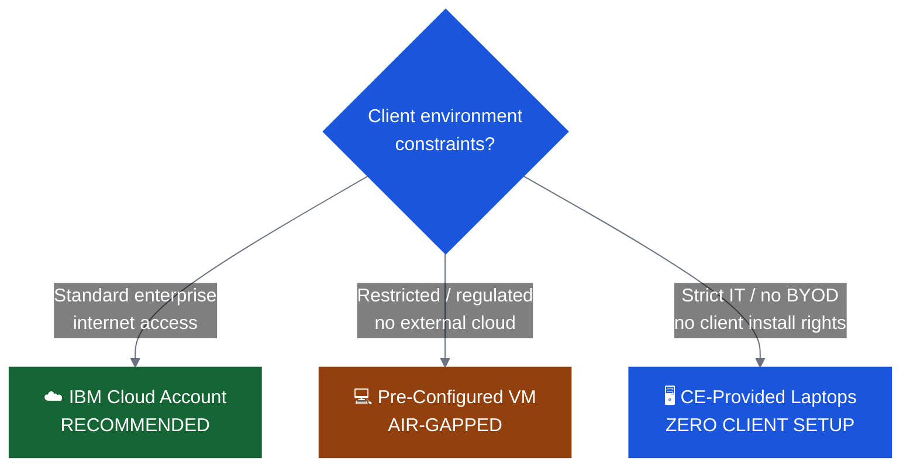

# Environment Options

Choose the setup path that fits your client's IT constraints. Confirm the environment early — this decision affects lead time, CE logistics, and day-of experience.

---

## Overview

---

## Option 1: IBM Cloud Account *(Recommended)*

**Best for:** Most enterprise clients with internet access.

| | |
|---|---|
| **Setup time** | ~10 minutes on the day |
| **Who sets it up** | Attendee creates free IBM Cloud account |
| **What's included** | Bob Premium accessed via cloud |

**Pros:**
- No software install required beyond Bob IDE
- Attendees keep their IBM Cloud account after the event
- Clean, consistent environment for all attendees

**Cons:**
- Requires internet access
- IBM Cloud account creation may require IT approval at some organizations

**CE Action:** Confirm with client IT that creating an IBM Cloud account is permitted. Check at least 1 week before the event.

---

## Option 2: Pre-Configured VM *(Air-Gapped)*

**Best for:** Restricted, regulated, or air-gapped environments.

| | |
|---|---|
| **Setup time** | CE provides image ahead of event |
| **Who sets it up** | IBM CE prepares VM; attendees run it |
| **What's included** | Bob + VS Code + sample application pre-loaded |

**Pros:**
- No client install permissions needed
- Works with no internet access
- Fully controlled environment

**Cons:**
- VM distribution logistics (USB, shared drive, etc.)
- Hardware requirements: attendee machines need sufficient RAM/CPU to run VM
- CE must prepare and test image in advance

**CE Action:** Build and test VM image at least 5 days before event. Confirm attendee hardware specs (min 8GB RAM, 4 cores recommended).

---

## Option 3: CE-Provided Laptops *(Zero Client Setup)*

**Best for:** Strict IT environments, no BYOD, environments where attendee machines cannot be trusted.

| | |
|---|---|
| **Setup time** | CE prepares laptops pre-loaded with tooling |
| **Who sets it up** | IBM CE brings hardware to the event |
| **What's included** | Attendees use CE hardware on the day |

**Pros:**
- No client machine or install required
- Fully controlled by IBM CE

**Cons:**
- Limited fleet capacity — plan headcount early
- Transport logistics and shipping lead times
- Availability varies by market/geography (e.g., see [Public Market](../markets/public-market.md) for regional fleet guidelines)

**CE Action:** Check with regional CE leadership on hardware fleet availability at least 2–3 weeks before the event. Plan 1 laptop per 1–2 attendees (sharing works for paired labs).

---

## The "Pilot Attendee" Verification Strategy

!!! tip "Crucial Verification Technique"
    During scoping, designate a **"pilot attendee"** — the participant with the strictest corporate permissions or lowest access level. Have this person test and verify all tool installations, cloud logins, and network access during the pre-event office hours.
    
    * **Require visual confirmation:** Ask for a screenshot or screen-share verification of their running setup.
    * **Signal indicator:** If the pilot attendee's environment succeeds, the rest of the cohort is almost guaranteed to work without day-of access failures.

---

## TechZone Environments

For Z and IBM i Bobathons, TechZone provides the backend infrastructure (LPARs, pp4z instances).

!!! warning "TechZone is a fallback for client machines — avoid for large groups"
    TechZone environments are slow to provision, can have access issues, and do not provide the same experience as a client's own machine. Prefer the IBM Cloud path whenever possible. Use TechZone only when no other option exists.

| Scenario | TechZone Use | Lead Time |
|---|---|---|
| Z Bobathon (pp4z backend) | Required for pp4z instance | **7+ days** — request immediately after scoping |
| IBM i Bobathon (LPAR) | Optional — Flight400 can run on shared LPAR | 7+ days |
| Java / SDLC | Not typically needed | — |

**Key TechZone actions:**
- IBM CE initiates TechZone request — do not leave to client
- Add all client attendees **before** the event
- Ensure account has required permissions and add-ons
- Test environment yourself before the pre-event office hours

---

## Environment Decision Checklist

- [ ] Internet access on the day confirmed (yes / restricted / none)
- [ ] Client IT policy on IBM Cloud account creation confirmed
- [ ] Client IT policy on installing VS Code and Bob confirmed
- [ ] Admin rights for attendees confirmed (needed for Java 21 install on Z/i tracks)
- [ ] Environment path selected and communicated to client
- [ ] CE preparation steps for chosen path initiated
- [ ] Environment tested by CE before pre-event office hours
