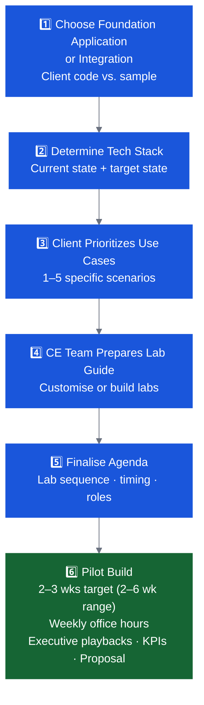

# Planning & Preparation Overview

Planning is where the scoping decisions become a concrete, deliverable event. This section covers everything from building the agenda to setting up environments and badging.

---

## Planning Timeline

```mermaid
%%{init: {'theme': 'base', 'themeVariables': {'primaryColor': '#1a56db', 'primaryTextColor': '#ffffff', 'primaryBorderColor': '#1a56db', 'lineColor': '#6b7280', 'mainBkg': '#1a56db', 'nodeBorder': '#1a56db', 'clusterBkg': '#1e3a5f', 'titleColor': '#ffffff', 'edgeLabelBackground': 'transparent'}}}%%
gantt
    title Bobathon Planning Timeline (Standard — GenApp/Sample Code)
    dateFormat  D
    axisFormat  Day -%d

    section Discovery
    Scoping call & decisions          :done, d1, 1, 3d

    section CE Logistics
    Submit DSR / assign CE            :done, d2, 3, 1d
    Provision TechZone / pp4z env     :active, d3, 4, 7d

    section Content Prep
    Select labs & build agenda        :d4, 4, 3d
    Run Bobathon Builder (Bob)        :d5, 5, 2d
    Customise lab guide               :d6, 7, 2d

    section Client Prep
    Send pre-event instructions       :d7, 7, 1d
    Office hours / pre-event check    :d8, 13, 1d
    Client installs prereqs           :d9, 13, 1d

    section Badging
    Create event in badge portal      :d10, 4, 1d
    Install badge mode in lab repo    :d11, 5, 1d

    section Event
    Bobathon Day                      :crit, d12, 15, 1d
```

!!! warning "Custom code adds 3 weeks"
    If using client code or building custom labs, the timeline above shifts right by 3 weeks minimum. Start the DSR and content prep immediately after scoping.

---

## Key Sections

- :material-checkbox-marked-circle: **[Pre-Event Checklist](checklist.md)**

    The complete checklist: attendee list, access setup, room logistics, content readiness, and day-of kit.

- :material-laptop: **[Environment Options](environment-options.md)**

    IBM Cloud account (recommended), pre-configured VM, or CE-provided laptops — with pros, cons, and setup guidance.

- :material-clock-time-four: **[Agenda Templates](agenda-templates.md)**

    Ready-to-use agenda templates for 90-min, half-day, full-day, and Z 4-hour formats. Customize per track.

- :material-office-building: **[Room & Logistics](logistics.md)**

    Room setup, file sharing, access provisioning, and day-of logistics.

- :material-robot: **[Building with Bob](build-with-bob.md)**

    Use the Bobathon Builder Mode and CE Marketplace to generate your agenda, customize labs, and build email templates — all with Bob.

- :material-file-document-edit: **[Client Context Spec Template](client-spec.md)**

    Structured template to capture client technical stack, pain points, and use cases before generating Bobathon assets.

- :material-medal: **[Badging Setup](badging.md)**

    Set up Credly badges for your Bobathon so participants can earn recognition for their work.

- :material-web: **[Bobathon Lab Website](lab-website.md)**

    Turn your Markdown labs into a client-branded, interactive web app — deployed to IBM Code Engine in minutes. Recommended for most Bobathons.

---

## The Bobathon Formula

Every successful Bobathon follows this six-step preparation formula:

---

## Example: Java Modernization

*Using the Pharmacy Manager application as illustration:*

| Step | Example |
|---|---|
| Foundation App | Pharmacy Manager (client's own Java EE app) |
| Tech Stack | Current: Traditional WAS + Java 8 + Struts UI → Target: Liberty + Java 21 + Angular |
| Use Cases | 1. Document code · 2. Interrogate code · 3. Improve testing · 4. Convert code · 5. Remediate vulnerabilities |
| Lab Guide | 5 labs, each with a starting snapshot + final endpoint, plus a baking show video |
| Agenda | Morning: Labs 1–2 (doc + interrogation) · Afternoon: Labs 3–5 (test, convert, security) |
| Follow-up | 2–3 week pilot (2–6 week range) with weekly office hours and executive playback |
