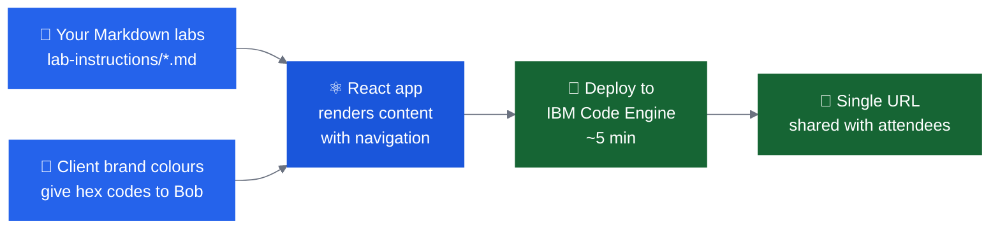

# Bobathon Lab Website

Instead of handing attendees markdown, a PDF, or shared document, you can deliver your Bobathon labs as a **client-branded, interactive web application**. The [Bobathon Lab Website template](https://github.ibm.com/tech-garage-canada/bobathon-lab-website) — contributed by the Tech Garage Canada team — provides a ready-to-use Vite/React app that renders your Markdown lab guides as a polished, navigable web UI, deployable to IBM Code Engine in under 10 minutes.

!!! tip "Recommended for most Bobathons"
    A branded lab website significantly improves the attendee experience and leaves a stronger impression than a shared document link. The setup overhead is low — and the [CE Bob Marketplace](https://ibm.biz/ce-bob-marketplace) has a dedicated collection of skills that handle the content wiring, branding, and deployment for you.

---

## Why Use a Lab Website

| Benefit | Detail |
|---|---|
| **Client branding** | Match the client's colours, logo, and typography — use Bob to generate the CSS changes from brand hex codes in minutes |
| **Better navigation** | Attendees move between labs, track progress, and return to specific steps without scrolling through a long document |
| **No file sharing friction** | Share a single URL instead of a PDF, Box link, or GitHub repo — works on any device in the room |
| **Persistent after the event** | The deployed URL stays live — the client's team can revisit labs independently after the Bobathon |
| **Professional presentation** | A purpose-built web UI signals investment and seriousness; it reinforces that this is not a generic demo |
| **Deploy to Code Engine** | Runs on IBM Code Engine with scale-to-zero — typically within the free tier for a single Bobathon |

---

## How It Works

The template separates content from presentation:

- **Labs** are plain Markdown files in `lab-instructions/` — write your labs the same way you always have
- **The React app** (`boblab/react-app/`) reads those files and renders them with a navigation sidebar, step indicators, and code syntax highlighting
- **Branding** is controlled by four CSS files — give Bob the client's hex codes and it updates them in one prompt
- **Deployment** is a single script that builds the Docker image, pushes to IBM Container Registry, and deploys to Code Engine



---

## CE Bob Marketplace Collection

The **[CE Bob Marketplace](https://ibm.biz/ce-bob-marketplace)** includes a dedicated collection — **IBM Bobathon Web UI** — that installs three skills covering the full lab website workflow:

| Skill | What it does |
|---|---|
| **bobathon-lab-content** | Registers new Markdown lab files into the React app — reads your lab files and updates `labs.js` with titles, descriptions, duration estimates, and difficulty ratings |
| **bobathon-react-styling** | Applies client branding to the app — takes hex colour codes and updates all four CSS files while maintaining WCAG AA contrast |
| **bobathon-code-engine-deploy** | Guides the IBM Code Engine deployment — validates your `.env` configuration, walks through the deployment script, and surfaces common errors |

Install the full collection from the Marketplace (search **"IBM Bobathon Web UI"**), or install individual skills as needed. Once installed, the skills are available in Bob during your lab website setup — invoke them directly rather than writing prompts from scratch.

!!! info "Collection source"
    [github.ibm.com/ClientEngineering/bob/tree/main/Collections/IBM-bobathon-web-UI](https://github.ibm.com/ClientEngineering/bob/tree/main/Collections/IBM-bobathon-web-UI)

---

## Setup

**1. Install the Marketplace collection**

Install the **IBM Bobathon Web UI** collection from the [CE Bob Marketplace](https://ibm.biz/ce-bob-marketplace) (search "IBM Bobathon Web UI"). One-click install — the three skills include all bundled reference templates (`labs.js`, CSS files, deploy script) and provide everything needed to build and deploy the app. Skip this if you prefer to use the raw prompts in the expandable sections below.

**Clone the template repository** *(optional)*

Cloning lets you iterate quickly on lab content and branding with the full file structure already in place. If you clone, the skills edit the repo files directly rather than scaffolding from their bundled references.

```bash
git clone https://github.ibm.com/tech-garage-canada/bobathon-lab-website
```

**2. Add your lab content**

Drop your Markdown lab files into `lab-instructions/` and use Bob to wire them into the app.

??? note "bobathon-lab-content skill / raw prompt"
    Use the **bobathon-lab-content** skill, or paste this prompt directly:
    ```
    I've added lab files to lab-instructions/. Please update
    boblab/react-app/src/content/labs.js to register each new lab,
    extracting the title from the markdown, estimating duration and
    difficulty, and following the existing entry pattern.
    ```

**3. Brand it for the client**

Give Bob the client's hex codes and it updates all four CSS files.

??? note "bobathon-react-styling skill / raw prompt"
    Use the **bobathon-react-styling** skill, or paste this prompt directly:
    ```
    Update the Bobathon Lab React app for [CLIENT NAME].
    Brand colours:
    - Primary: [hex]
    - Secondary: [hex]
    - Background: [hex]
    - Text: [hex]
    Update src/App.css, src/index.css, src/lab.css, and src/styles.css.
    Maintain WCAG AA contrast ratios throughout.
    ```

**4. Deploy to IBM Code Engine**

Fill in `boblab/.env` (IBM Cloud API key, region, container registry namespace) and run the deployment script. Use the **bobathon-code-engine-deploy** skill to validate your config before running.

```bash
cd boblab/react-app
./deploy-with-apikey.sh
```

First deployment takes 5–10 minutes; redeploys 3–5 minutes. The script outputs the public URL when complete.

!!! info "Cost"
    Code Engine scales to zero when idle. The app typically stays within the free tier (100,000 vCPU-seconds/month) for a single Bobathon.

---

## When to Use It

| Situation | Recommendation |
|---|---|
| Standard Bobathon, 1 week+ lead time | ✅ Use it — setup is fast enough |
| Same-week turnaround or scrambled setup | ⚠️ Skip it — use the shared Markdown directly |
| High-value or executive-visible account | ✅ Strongly recommended — branding matters |
| Repeat client (second Bobathon) | ✅ Redeploy with updated labs; they already have the URL pattern |
| CVE-led session (focus product) | ✅ Brand to the SaaS product's colour scheme, not generic IBM |

---

## Further Reading

| Resource | Link |
|---|---|
| Template repository | [github.ibm.com/tech-garage-canada/bobathon-lab-website](https://github.ibm.com/tech-garage-canada/bobathon-lab-website) |
| IBM Code Engine docs | [cloud.ibm.com/docs/codeengine](https://cloud.ibm.com/docs/codeengine) |
| Contributed by | Tech Garage Canada |
